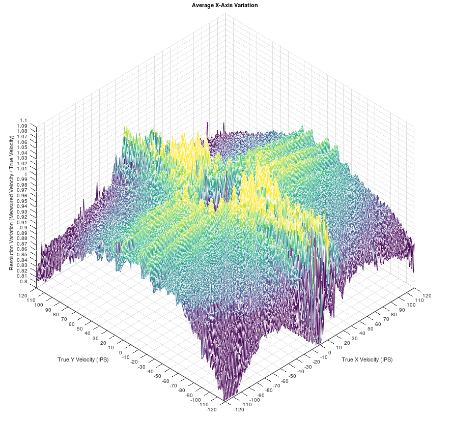
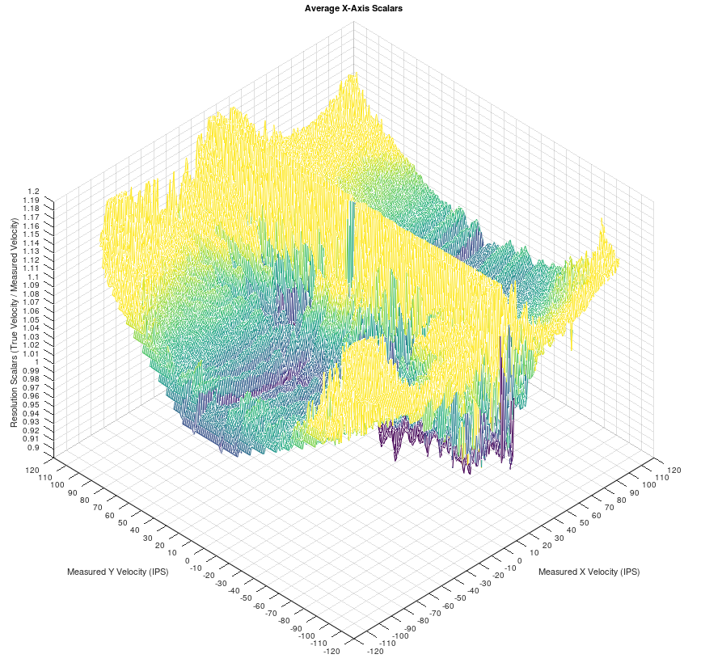
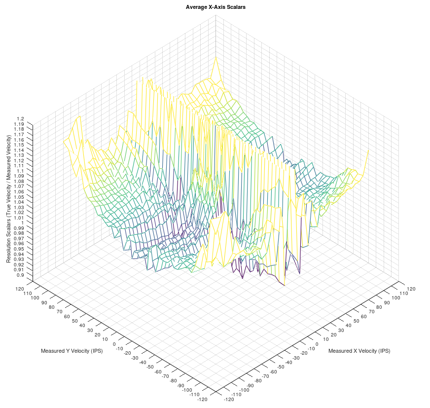
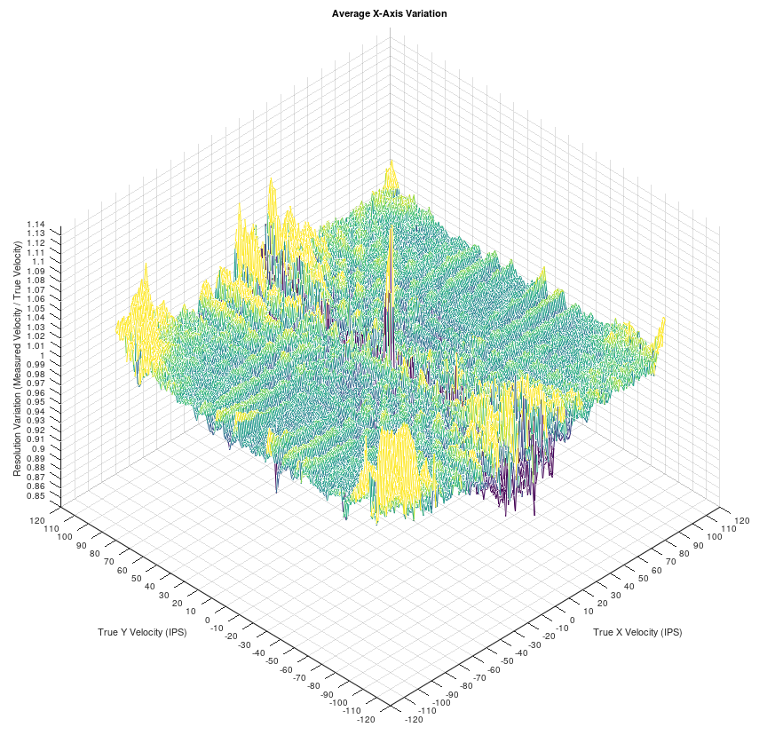
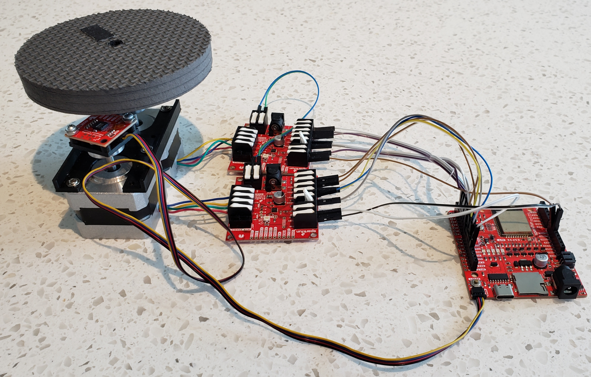
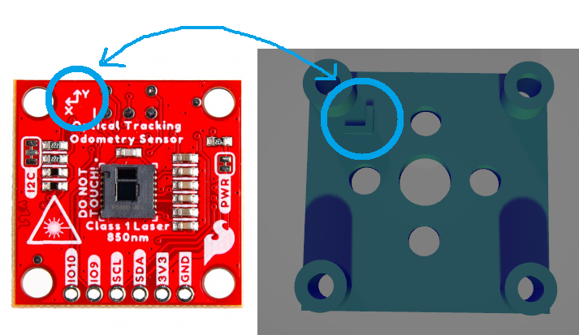
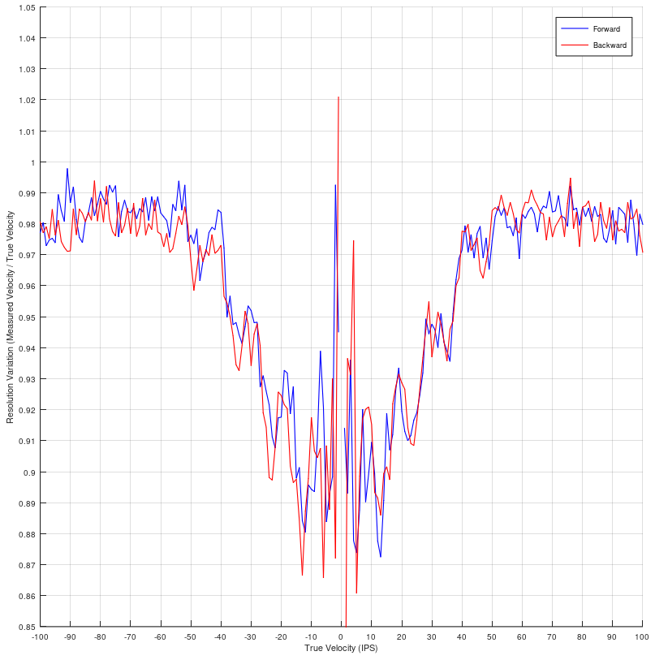
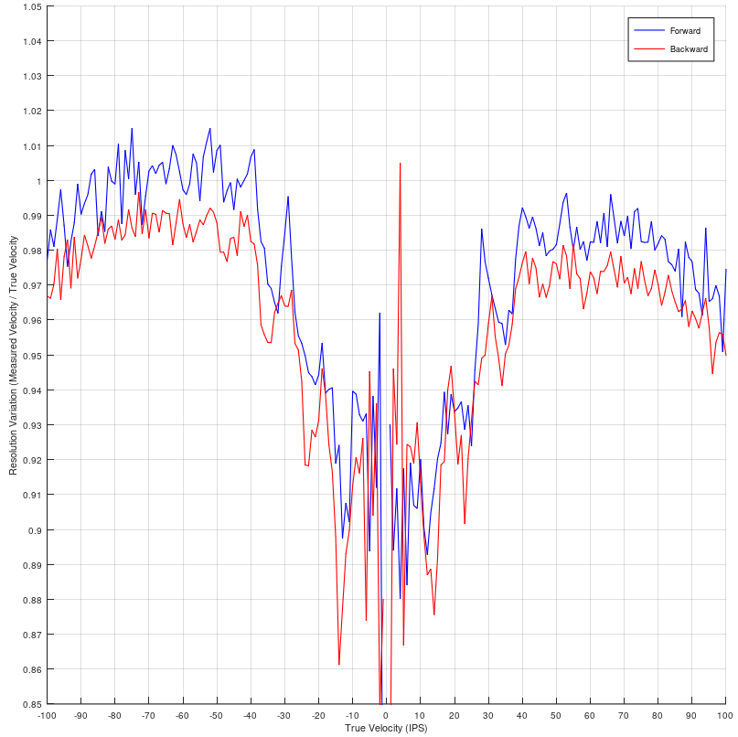

# SparkFun OTOS Lookup Table Calibration

This folder contains the scripts and files that were used to create the lookup table calibration for the [SparkFun Optical Tracking Odometry Sensor](https://www.sparkfun.com/products/24904). This is mainly provided for transparency on how the lookup table was created. **This is not a tutorial, and no support will be provided for anyone attempting to do this themselves!** This requires many pieces of software and hardware, some details are ommitted, and it can take **many hours** to go from nothing to a final lookup table.

## Precursory Info

The PAA5160 is the optical tracking sensor used on the board, and it was discovered in testing that there is resolution variation based on how fast the surface is moving. However the resolution variation is nonlinear, and the variation for one axis depends on the velocity in both axes. Below is a plot of the x-axis resolution variation (measured velocity divided by true velocity) versus the true velocity in both axes, where the color scale goes from 0.9 (purple) to 1.0 (yellow):

Ideally, this should be a flat surface, but has the overall shape of an inverted paraboloid with ridges in both directions. The y-axis is similar, but with flipped x and y axes. The y-axis is also slightly asymetric, likely due to the laser being off-center from the sensor.

Testing has shown this variation to be consitent per sensor, and fairly similar between different sensors. The idea to correct this is to store this variation in the firmware, then at every time step, measure the velocity and multiply it by the inverse of the variation at that velocity. Theoretically, this should cause the surface to become flat.

Rather than storing the variation, the inverse (referred to as the scalar lookup table) is stored in order to reduce the amount of floating point division in each loop iteration to optimize performance. The image below is shows the scalar lookup table versus the *measured* velocity in both axes (instead of the *true* velocity, since that's not known at runtime):

The firmware needs to store this lookup table up to +/- 100 in/s (2.5m/s), which is the max rated speed of the PAA5160. The lookup table in the image above has a resolution of 1 in/s, meaning 201 * 201 = 40,401 data points would need to be stored. The STM32C0 microcontroller on the board only has 32k of flash memory, so this needs to be stored more efficiently.

The main space savings here is to store a sparse version of this lookup tableT Firmware version v1.0 uses 51 * 51 = 2,601 data points; the 51 grid coordinate were chosen by hand to capture just the peaks and valleys. At every time step, the measured velocity is used to index into the lookup table, and a bilinear interpolation is used to approximate the correct scaling value. Below is an image of the sparse lookup table:

The other memory saving measure is to store each value in a single byte, requiring only about 2.6kB (5.2kB total, since a separate lookup table is needed for each axis). Each byte has a resolution of 0.2%, allowing scaling values from 0.774 to 1.254.

To verify this makes an improvement, the resolution variation from the data in the first figure above is multiplied by the interpolated sparse lookup table, which results in the surface below, where the color scale goes from 0.98 (purple) to 1.02 (yellow):

The surface is overall much more flat than before. Some ridges are and other fluctuations are still present, at least partially due to the innaccuracy of the sparse lookup table. Although in reality there is more variation than this, since the measurement noise causes the lookup table to be indexed into the wrong place, meaning a slightly incorrect scaling value is used. But the main benefit is that the surface is overall flat instead of an inverted paraboloid.

## Materials Used

This calibration is done by spinning a disc of the surface in front of the sensor at a range of speeds and angles to generate the resolution variation data in the first image above. Below is an image of the setup used:

This setup uses the following hardware:

* 1x [12V power supply](https://www.sparkfun.com/products/15313) (at least 500mA)
* 2x [stepper motors](https://www.sparkfun.com/products/9238)
* 2x [stepper motor hubs](https://www.sparkfun.com/products/10006)
* M3 and 4-40 screws
* 2x [stepper motor drivers](https://www.sparkfun.com/products/16836)
* 1x [ESP32 IoT RedBoard](https://www.sparkfun.com/products/19177)
* 1x [Optical Tracking Odometry Sensor](https://www.sparkfun.com/products/24904)
* [Jumper wires](https://www.sparkfun.com/products/12795)
* 1x [Qwiic Cable](https://www.sparkfun.com/products/17257)
* Disc of surface, at least 4" diameter
    * In this setup, an FTC foam tile was cut using a CNC milling machine into a 4" diameter disc with an 0.3" hole in the center for mounting
* 3D printed parts:
    * [Motor bracket](3D_Printables/stepper_motor_bracket.stl) (positions shafts 1.75" apart from each other)
    * [OTOS mount](3D_Printables/stepper_otos_mount.stl)
    * [Disc mount](3D_Printables/stepper_disc_mount.stl) (works with FTC foam tile disc, but another design may be needed for other discs)

And the following software is required:

* [Arduino IDE](https://www.arduino.cc/en/software) with [ESP32 core](https://github.com/espressif/arduino-esp32) to program the IoT RedBoard
* [MATLAB](https://www.mathworks.com/products/matlab.html) (not tested) or [GNU Octave](https://octave.org/) (free) to run included scripts
    * If using Octave,the [Intrument Control Package](https://octave.sourceforge.io/instrument-control/index.html) needs to be installed; a tutorial is available [here](https://www.edn.com/read-serial-data-directly-into-octave/)
* [STM32CubeIDE](https://www.st.com/en/development-tools/stm32cubeide.html) and [STM32CubeProgrammer](https://www.st.com/en/development-tools/stm32cubeprog.html) to modify, build, and flash the firmware with the new calibration to the sensor, see instructions [here](../README.md)

Again, this is not a tutorial, this is only documentation on how this lookup table calibration was done for transparency. If you want to do this yourself, you may need to substitute some items, design your own 3D printed mounts, modify some code, etc. **Support will not be provided, you'll be on your own!**

## Calibration Process

Note - This setup has the optical sensor oriented upwards. It includes an IR bandpass filter, so it is usually not necessary to block ambient light. However if the room has sunlight coming through a window, it may be necessary to add some kind of light shield around the setup, otherwise the optical sensor can lose tracking. This can be done with something like a large carboard box over the entire setup.

### Assembly

Assemble the setup as shown in the image above. Ensure the disc is positioned at a suitable distance from the sensor (10mm is used for the FTC foam tile). See the [Arduino sketch](Data_Collection/Data_Collection.ino) for the connections between the IoT RedBoard and stepper motor drivers. The stepper motor wires were connected to the drivers with the following pinout:

* A+ -> Blue
* A- -> Yellow
* B+ -> Red
* B- -> Green

The provided mount for the OTOS is not symmetric. The optical sensor on the board has the laser and sensing element slightly off-center, and this needs to be accounted for to get accurate data. The mount includes a feature indicating the intended orientation of the sensor, align the axes in the silkscreen with this feature.

### Verification Test

The following tests should be performed to verify the setup is working. Open the [Arduino sketch](Data_Collection/Data_Collection.ino), then change the value of `currentTest` near the top of the sketch and run the following tests in order:

* OTOS Angle
    * This should rotate the OTOS stepper by +90 degrees, then -90 degrees. This will verify the correct motor is being controlled, and that it rotates in the correct direcion and angle.
* Disc Ramp
    * This should spin the disc stepper, ramping up to speed the max speed required by the final data collection test, then ramping back down to zero.
    * This test can also be used to ensure the disc does not wobble while spinning; it may be necessary to shim the 3D printed mount.
    * If the disc motor stops spinning at high speed, it may be necessary to add more mass so it has more inertia.
* Zero Angle
    * This should spin the disc stepper at a medium speed, then use the data from the optical sensor to zero the angle of the OTOS relative to the surface motion.

### OTOS Mount Centering

The mount will get the optical sensor close to centered on the motor shaft, but the mounting holes allow for some variation in exact location. The sensor should be positioned as close to center as possible to get the most accurate data for the final data collection test. This can be done using the mount centering test:

Edit the value of `currentTest` to run the mount centering test. This will first find the zero angle for the optical sensor, then sweep the disc through a range of speeds in all 4 orthogonal directions.

While the test is running, it is also necessary to run the [mounting test script](Data_Collection/otos_mounting_test.m) in MATLAB or Octave to collect the data from the test and generate the output plots. Set the COM port used by the IoT RedBoard near the top of the script, then run the script while the zero angle is being found to synchronize with the start of the test.

Once the test completes, 2x plots similar to the following should be displayed:

If the red and blue lines overlap with each other in both plots like above, then the sensor is well centered. If it's not centered, there will be an offset between the lines like below:

In this case, the sensor needs to be re-mounted, and shifted in whatever direction causes the lines to overlap. The noise in the data can be reduced by increasing the value of `numSamples` near the top of the Arduino sketch, although this increases the amount of time the test takes.

### Data Collection

Once everything above has been completed, data collection can begin to create the lookup table. Edit the value of `currentTest` to run the data collection test. This will first find the zero angle for the optical sensor, then sweep the disc speed and sensor angle through a grid of velocities.

While the test is running, it is also necessary to run the [lookup table data collection script](Data_Collection/otos_mounting_test.m) in MATLAB or Octave to collect the data from the test and generate the output plots. Set the COM port used by the IoT RedBoard near the top of the script, then run the script while the zero angle is being found to synchronize with the start of the test.

Note - **THIS TEST TAKES A LONG TIME!** By default, it measures velocities from -120 to +120 in/sec with 1 in/sec resolution, which results in 241 * 241 = **58,081 data points**. With `numSamples` set to the default of 8, it makes about 16x measurements per second, so **this takes about an hour**. However if only a single sensor is calibrated, the data will likely be too noisy for a good lookup table, so it is recommended to increase `numSamples` by 8x (which increases the test time by the same amount). The lookup table used in firmware v1.0 was generated with `numSamples` set to 8, and averaged across 8 different sensors (effectively 64 samples per data point).

Note - In the final data collection test, the zero angle may be slightly off; this can be corrected by editing `correctionAngle` near the top of the sketch. This is easiest to identify early in the test if the output plot looks significantly asymmetric.

Once the test completes, the data will be saved to a pair of CSV files, which can be used in [this script](Calibration_Data/average_variation_and_compute_lookup_tables.m) to compute the final lookup tables. The CSV files included in [Calibration_Data](Calibration_Data/) folder is the data used to create the final lookup table used in firmware version v1.0.
