!!! attention

	All of the examples require the user to enter a key into the serial monitor before the example starts, which triggers the IMU calibration. 

!!! attention

	The IMU on the Optical Tracking Odometry Sensor includes a gyroscope and accelerometer, which could have an offset. The OTOS performs a quick calibration when it powers up, but it is recommended to perform a more thorough calibration at the start of all your programs. 

###Example 1: Basic Readings

This first example just does some basic measurements to make sure everything is hooked up correctly. To find Example 1, go to **File** > **Examples** > **SparkFun Qwiic OTOS** > **Example1_BasicReadings**:


<figure markdown>
[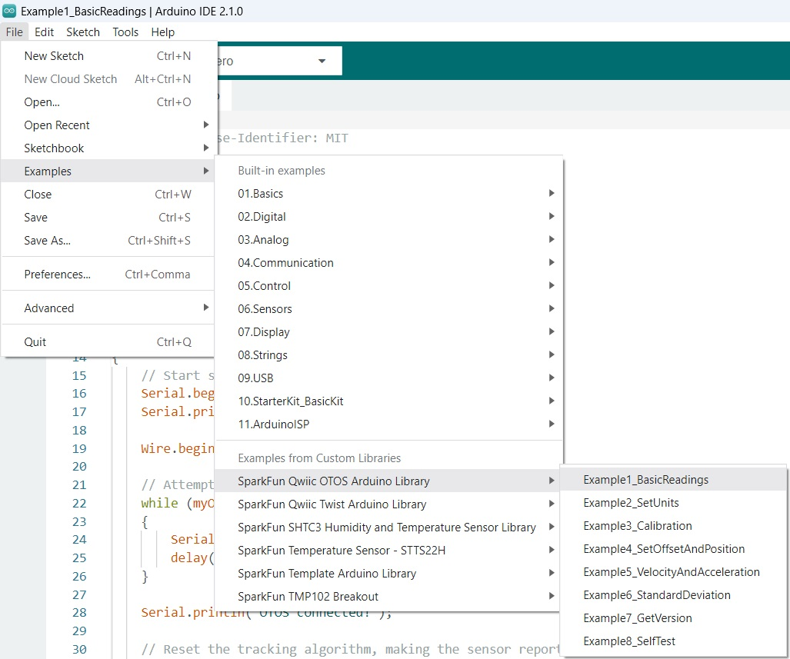{ width="600" }](assets/img/Arduino_Example_1_Menu.jpg "Click to enlarge")
<figcaption markdown>Finding Example 1</figcaption>
</figure>

Alternatively, you can expand the link below and copy and paste the code into a shiny new Arduino sketch: 

??? "Example 1 Arduino Code"
	```
	--8<-- "https://raw.githubusercontent.com/sparkfun/SparkFun_Qwiic_OTOS_Arduino_Library/main/examples/Example1_BasicReadings/Example1_BasicReadings.ino"
	```


Make sure you've selected the correct board and port in the Tools menu and then hit the upload button. Once the code has finished uploading, go ahead and open a [Serial Monitor](https://learn.sparkfun.com/tutorials/terminal-basics). You should see something similar to the following.  

<figure markdown>
[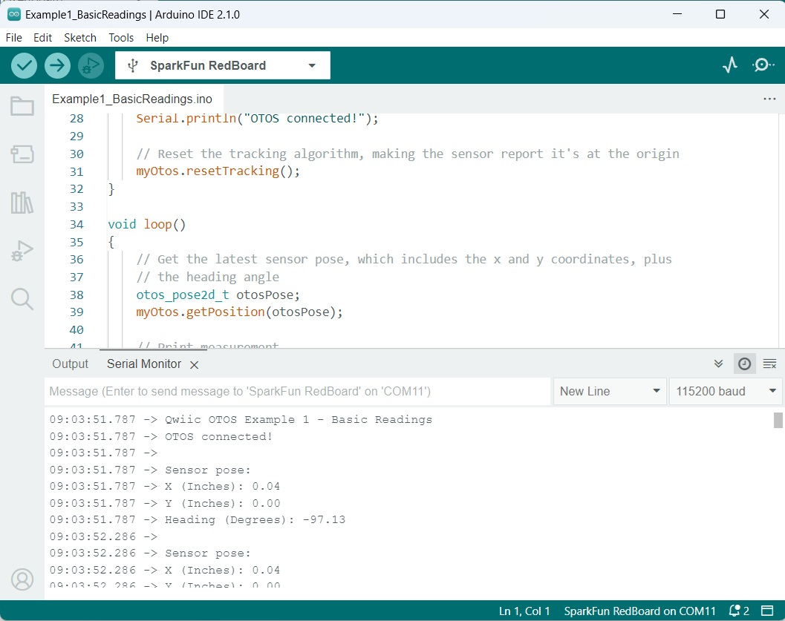{ width="600" }](assets/img/Arduino_Example_1_Output.jpg "Click to enlarge")
<figcaption markdown>Example 1 Output</figcaption>
</figure>

Move the sensor around to see how the coordinates change!


###Example 2: SetUnits

This example sets the desired units for linear and angular measurements. Can be either meters or inches for linear, and radians or degrees for angular. If not set, the default is inches and degrees. Note that this setting is not stored in the sensor, it's part of the library, so you need to set at the start of all your programs.

To find Example 2, go to **File** > **Examples** > **SparkFun Qwiic OTOS** > **Example2_SetUnits**:


<figure markdown>
[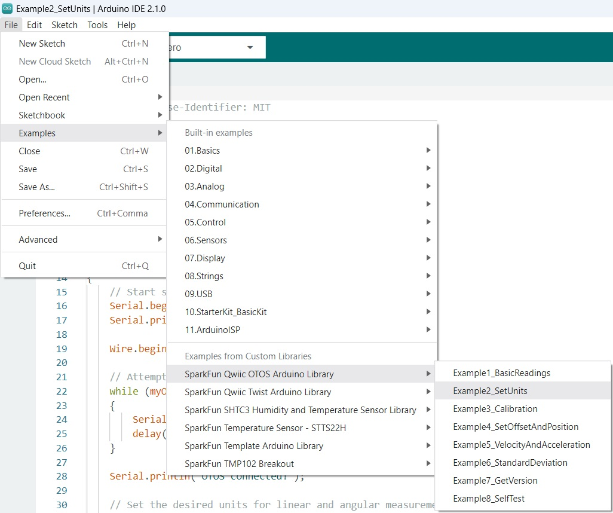{ width="600" }](assets/img/Arduino_Example_2_Menu.jpg "Click to enlarge")
<figcaption markdown>Finding Example 2</figcaption>
</figure>

Alternatively, you can expand the link below and copy and paste the code into a shiny new Arduino sketch: 


??? "Example 2 Arduino Code"
	```
	--8<-- "https://raw.githubusercontent.com/sparkfun/SparkFun_Qwiic_OTOS_Arduino_Library/main/examples/Example2_SetUnits/Example2_SetUnits.ino"
	```

Notice the following code snippet - this is the section of code that allows you to choose your units: 

<figure markdown>
[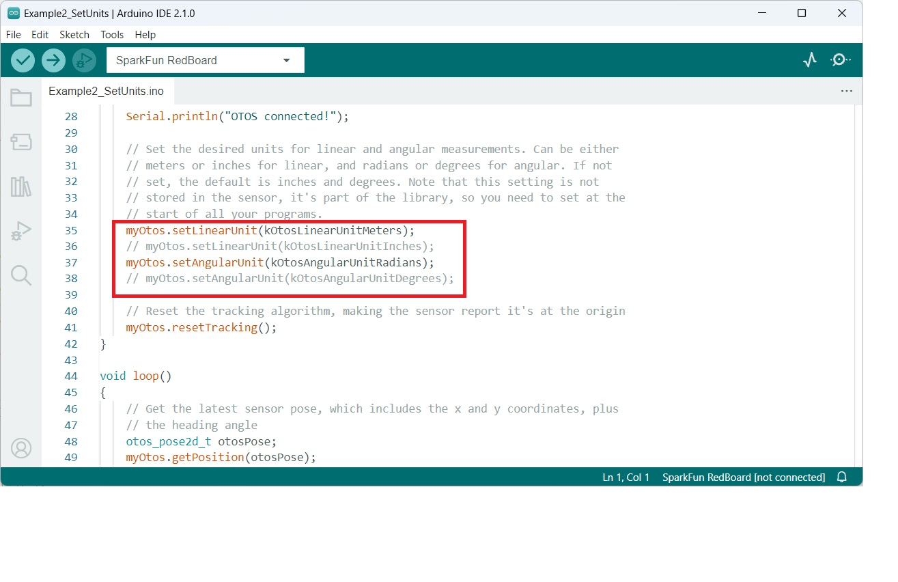{ width="600" }](assets/img/Arduino_Example_2_CodeSnippet.jpg "Click to enlarge")
<figcaption markdown>Example 2 Code To Change Units </figcaption>
</figure>


Make sure you've selected the correct board and port in the Tools menu and then hit the upload button. Once the code has finished uploading, go ahead and open a [Serial Monitor](https://learn.sparkfun.com/tutorials/terminal-basics). You should see something similar to the following.  

<figure markdown>
[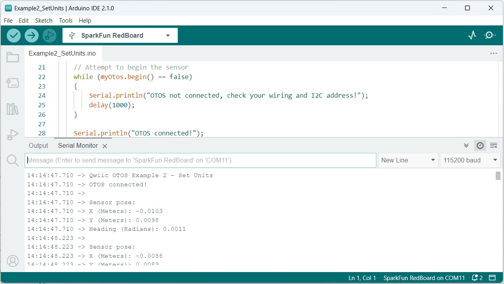{ width="600" }](assets/img/Arduino_Example_2_Output.jpg "Click to enlarge")
<figcaption markdown>Example 2 Output</figcaption>
</figure>


###Example 3: Calibration

!!! warning

	As of firmware version 1.0, these calibration values will be lost after a power cycle, so you will need to set them each time you power up the sensor.


The data from the OTOS will likely have minor scaling errors that can be calibrated out. This is especially important for the angular scalar, because an incorrect angle measurement causes the linear measurements to be rotated by the wrong angle in the firmware, which can lead to very inaccurate tracking.

To find Example 3, go to **File** > **Examples** > **SparkFun Qwiic OTOS** > **Example3_Calibration**:


<figure markdown>
[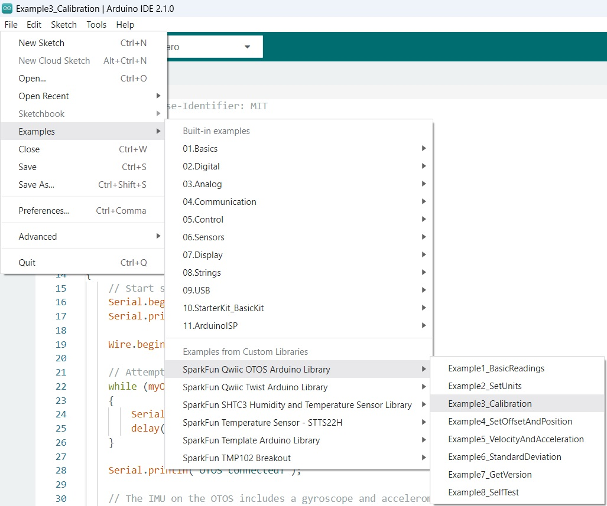{ width="600" }](assets/img/Arduino_Example_3_Menu.jpg "Click to enlarge")
<figcaption markdown>Finding Example 3</figcaption>
</figure>

Alternatively, you can expand the link below and copy and paste the code into a shiny new Arduino sketch: 


??? "Example 3 Arduino Code"
	```
	--8<-- "https://raw.githubusercontent.com/sparkfun/SparkFun_Qwiic_OTOS_Arduino_Library/main/examples/Example3_Calibration/Example3_Calibration.ino"
	```


Make sure you've selected the correct board and port in the Tools menu and then hit the upload button. Once the code has finished uploading, go ahead and open a [Serial Monitor](https://learn.sparkfun.com/tutorials/terminal-basics).

Calibrating your bot requires you to move it around a bit. First, set both scalars to 1.0, then calibrate the angular scalar, then the linear scalar. 

To calibrate the angular scalar, spin the robot by multiple rotations (eg. 10) to get a precise error, then set the scalar to the inverse of the error. Remember that the angle wraps from -180 to 180 degrees, so for example, if after 10 rotations counterclockwise(positive rotation), the sensor reports -15 degrees, the required scalar would be 3600/3585 = 1.004. 

<figure markdown>
[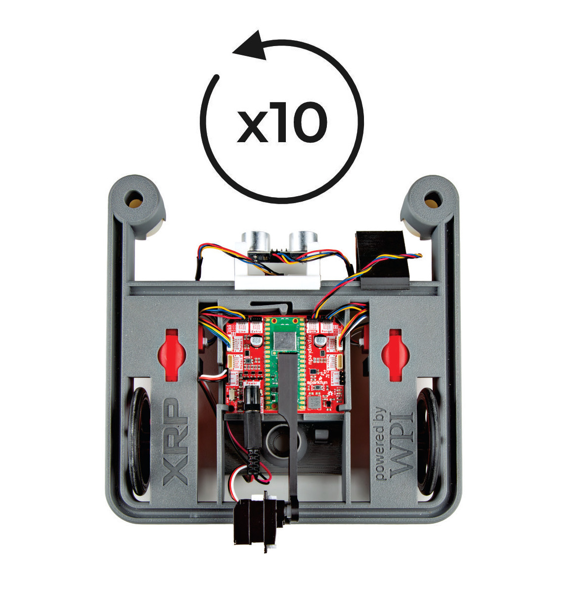{ width="600" }](assets/img/SEN-24904-XRP-Rotation.jpg "Click to enlarge")
<figcaption markdown>Rotating the Optical Tracking Odometry Sensor</figcaption>
</figure>


To calibrate the linear scalar, move the robot a known distance and measure the error; do this multiple times at multiple speeds to get an average, then set the linear scalar to the inverse of the error. For example, if you move the robot 100 inches and the sensor reports 103 inches, set the linear scalar to 100/103 = 0.971. 


<figure markdown>
[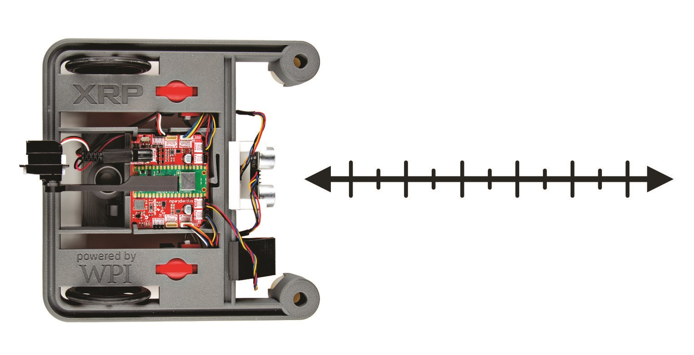{ width="600" }](assets/img/SEN-24904-XRP-Distance.jpg "Click to enlarge")
<figcaption markdown>Moving the Optical Tracking Odometry Sensor</figcaption>
</figure>


###Example 4: SetOffsetAndPosition 

This example shows how to set the offset for the sensor relative to the center of the robot. The units default to inches and degrees, but if you want to use different units, make sure you specify them before setting the offset. Without setting the offset, the OTOS will report the coordinates of itself. If the offset is set, the OTOS will instead report the coordinates of the center of your robot.

Note that the OTOS typically starts tracking from the origin, but if your robot starts at some other location, or you have another source of location information from another sensor that's more accurate, you can send the current location to the OTOS and it will continue tracking from there.

!!! warning 

    As of firmware version 1.0, these values will be lost after a power cycle, so you will need to set them each time you power up the sensor. 


To find Example 4, go to **File** > **Examples** > **SparkFun Qwiic OTOS** > **Example4_SetOffsetAndPosition**:


<figure markdown>
[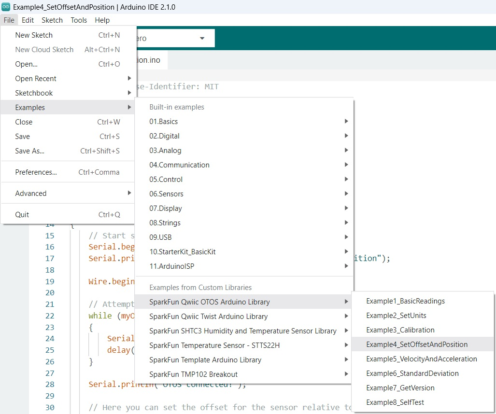{ width="600" }](assets/img/Arduino_Example_4_Menu.jpg "Click to enlarge")
<figcaption markdown>Finding Example 4</figcaption>
</figure>

Alternatively, you can expand the link below and copy and paste the code into a shiny new Arduino sketch: 


??? "Example 4 Arduino Code"
	```
	--8<-- "https://raw.githubusercontent.com/sparkfun/SparkFun_Qwiic_OTOS_Arduino_Library/main/examples/Example4_SetOffsetAndPosition/Example4_SetOffsetAndPosition.ino"
	```


If the sensor is mounted 5 inches to the left (negative X) and 10 inches forward (positive Y) of the center of the robot, and mounted 90 degrees clockwise (negative rotation) from the robot's orientation, the offset would be {-5, 10, -90}. These can be any value, even the angle can be tweaked slightly to compensate for imperfect mounting (eg. 1.3 degrees).

<figure markdown>
[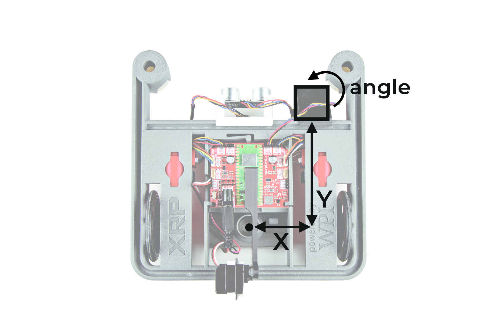{ width="600" }](assets/img/SEN-24904-XRP-XY-Offset.jpg "Click to enlarge")
<figcaption markdown>The X, Y, and Angular Offset of the Optical Tracking Sensor</figcaption>
</figure>


These four examples cover the basics - there are more examples to explore in the library! 


<!--
###Example 5: VelocityAndAcceleration

This example prints out the velocity and acceleration of the bot as it moves. 


To find Example 5, go to **File** > **Examples** > **SparkFun Qwiic OTOS** > **Example5_VelocityAndAcceleration**:


<figure markdown>
[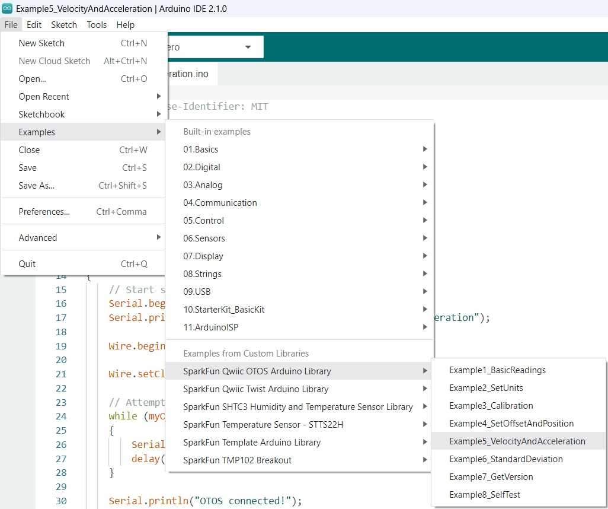{ width="600" }](assets/img/Arduino_Example_5_Menu.jpg "Click to enlarge")
<figcaption markdown>Finding Example 5</figcaption>
</figure>

Alternatively, you can expand the link below and copy and paste the code into a shiny new Arduino sketch: 


??? "Example 5 Arduino Code"
	```
	--8<-- ""
	```

https://raw.githubusercontent.com/sparkfun/SparkFun_Qwiic_OTOS_Arduino_Library/v1.0.0/examples/Example5_VelocityAndAcceleration/Example5_VelocityAndAcceleration.ino


###Example 6: StandardDeviation

This example reads the standard deviation of the tracking. Note that these values are just the square root of the diagonal elements of the covariance matrices of the Kalman filters used in the firmware of the OTOS and not actual tracking error data. 

!!! warning 

    THESE VALUES DO NOT REPRESENT THE ACTUAL TRACKING ERROR! These are statistical quantities that assume a correct model of the system, but there could be unmodelled error sources that cause the physical error to become larger than these statistical error (eg. improper calibration, or rotating the OTOS to not be flat against the tracking surface). These are provided primarily for anyone wanting to perform sensor fusion with additional sensors, but they can be used to at least "get an idea" of the quality of the accuracy.
    


To find Example 6, go to **File** > **Examples** > **SparkFun Qwiic OTOS** > **Example6_StandardDeviation**:


<figure markdown>
[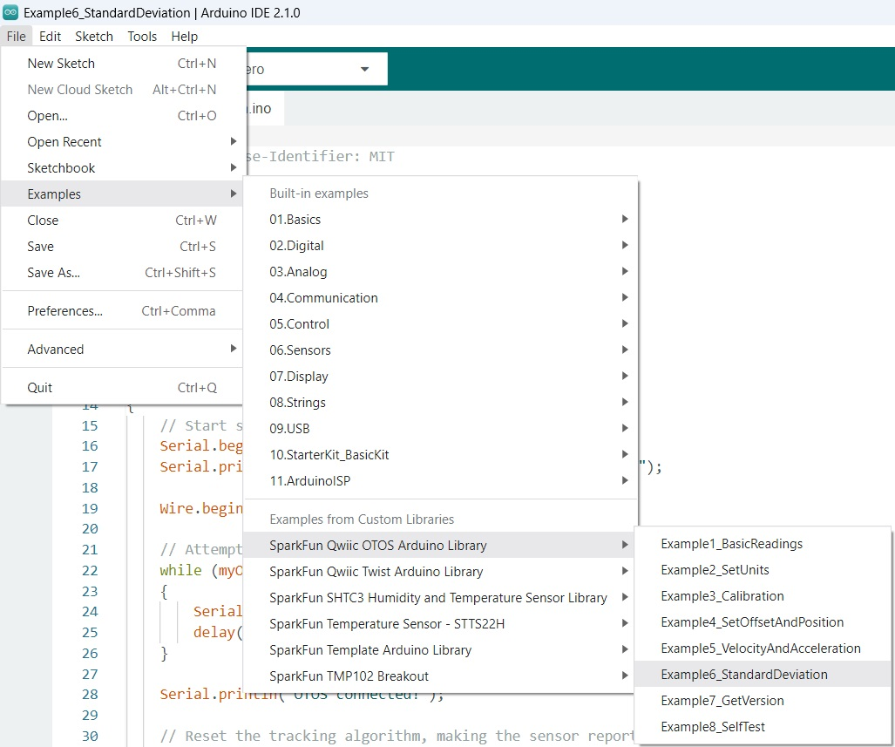{ width="600" }](assets/img/Arduino_Example_6_Menu.jpg "Click to enlarge")
<figcaption markdown>Finding Example 6</figcaption>
</figure>

Alternatively, you can expand the link below and copy and paste the code into a shiny new Arduino sketch: 


??? "Example 6 Arduino Code"
	```
	--8<-- ""
	```

https://raw.githubusercontent.com/sparkfun/SparkFun_Qwiic_OTOS_Arduino_Library/v1.0.0/examples/Example6_StandardDeviation/Example6_StandardDeviation.ino


###Example 7: GetVersion

This should be fairly self explanatory. This example gets the current hardware and firmware version of the board. 


To find Example 7, go to **File** > **Examples** > **SparkFun Qwiic OTOS** > **Example7_GetVersion**:


<figure markdown>
[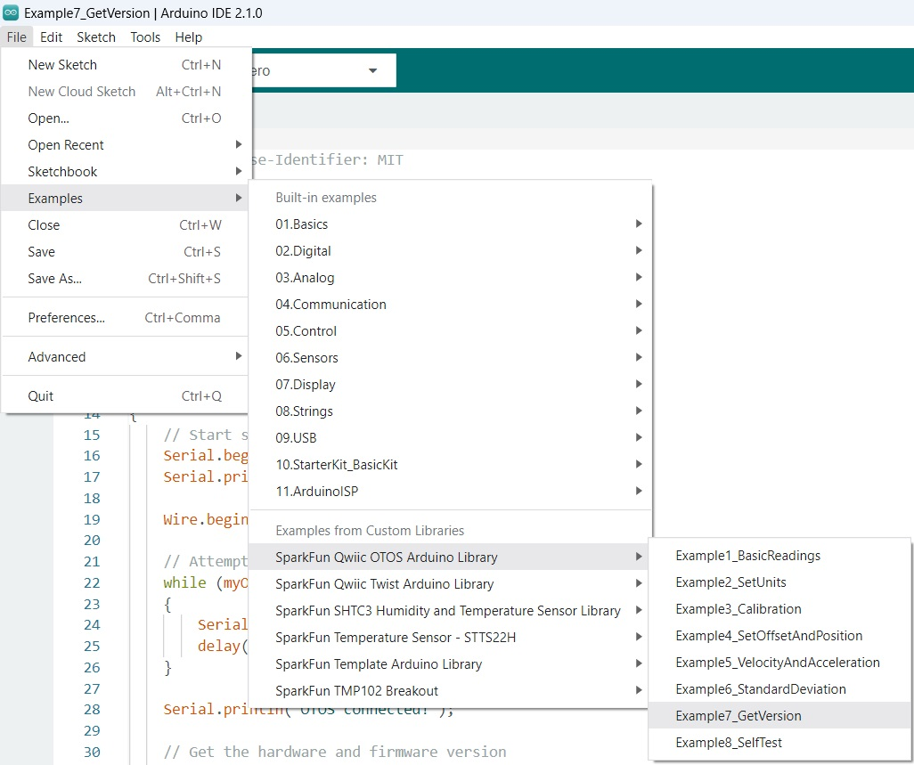{ width="600" }](assets/img/Arduino_Example_7_Menu.jpg "Click to enlarge")
<figcaption markdown>Finding Example 7</figcaption>
</figure>

Alternatively, you can expand the link below and copy and paste the code into a shiny new Arduino sketch: 

??? "Example 7 Arduino Code"
	```
	--8<-- ""
	```
https://raw.githubusercontent.com/sparkfun/SparkFun_Qwiic_OTOS_Arduino_Library/v1.0.0/examples/Example7_GetVersion/Example7_GetVersion.ino


Make sure you've selected the correct board and port in the Tools menu and then hit the upload button. Once the code has finished uploading, go ahead and open a [Serial Monitor](https://learn.sparkfun.com/tutorials/terminal-basics). You should see something similar to the following: 

<figure markdown>
[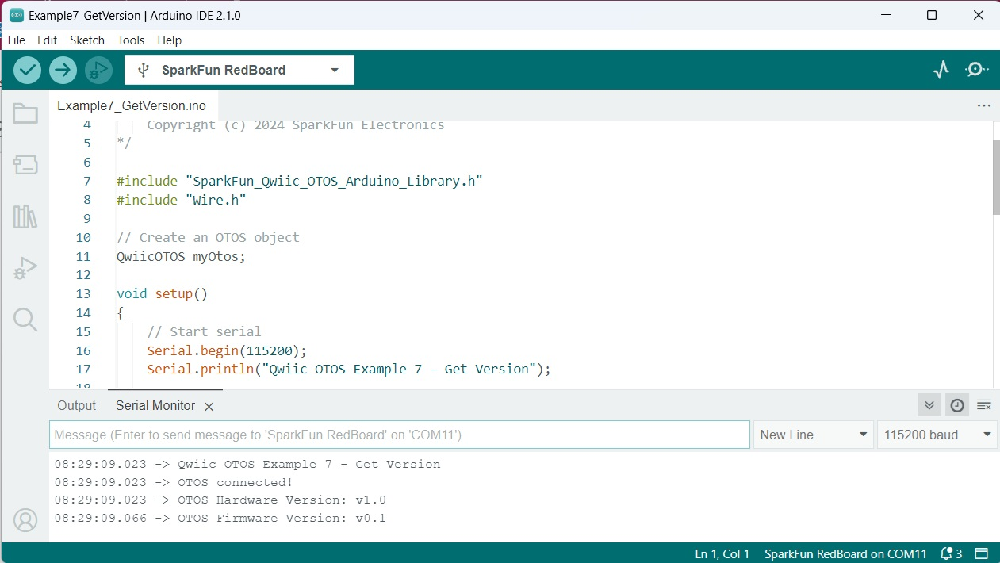{ width="600" }](assets/img/Arduino_Example_7_Output.jpg "Click to enlarge")
<figcaption markdown>Example 7 Output</figcaption>
</figure>


###Example 8: SelfTest 

Again, this should be self explanatory. This example tests the basics to make sure everything is working as expected. 

To find Example 8, go to **File** > **Examples** > **SparkFun Qwiic OTOS** > **Example8_SelfTest**:


<figure markdown>
[{ width="600" }](assets/img/Arduino_Example_8_Menu.jpg "Click to enlarge")
<figcaption markdown>Finding Example 8</figcaption>
</figure>

Alternatively, you can expand the link below and copy and paste the code into a shiny new Arduino sketch: 


??? "Example 8 Arduino Code"
	```
	--8<-- ""
	```
<!--
https://raw.githubusercontent.com/sparkfun/SparkFun_Qwiic_OTOS_Arduino_Library/v1.0.0/examples/Example8_SelfTest/Example8_SelfTest.ino
-->


