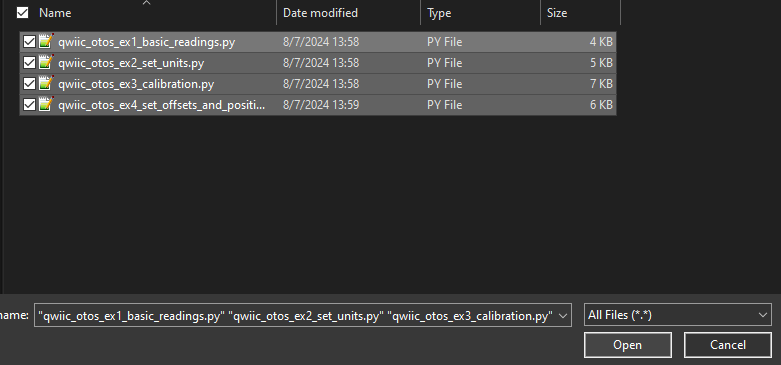
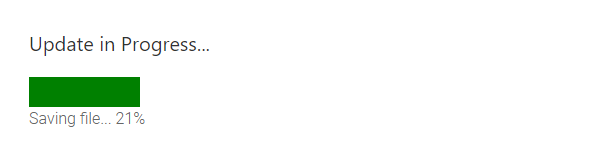
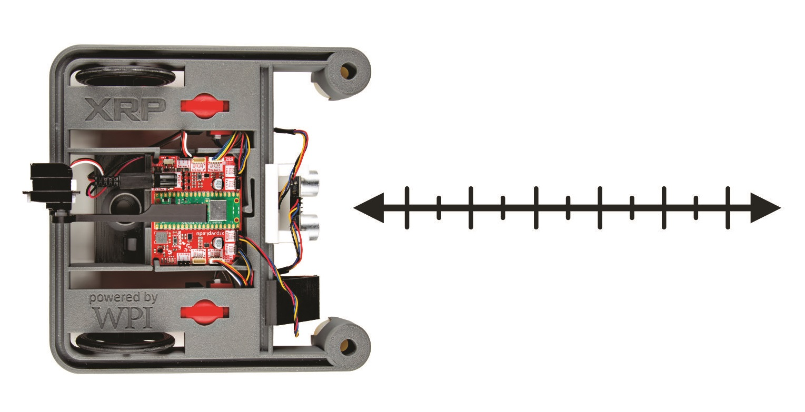

!!! attention
	These instructions are written for the XRP using the [XRPCode IDE](https://xrpcode.wpi.edu/). However the setup process is very similar for MicroPython and CircuitPython on any other board, so you should be able to follow along with these instructions using your IDE of choice!

## Download Examples

First, go to the [Qwiic_OTOS_Py repository](https://github.com/sparkfun/Qwiic_OTOS_Py), open the `examples` folder, and download the example files you want to run.

Connect your XRP to your computer over USB, navigate to the [XRPCode editor](https://xrpcode.wpi.edu/), and connect to your XRP. For usage information, see the [XRPCode User Guide](https://xrpusersguide.readthedocs.io/en/latest/course/XRPCode.html).

Upload the example files into the root directory (`/`), or directory of your choice, on the XRP. Begin by finding the `Upload to XRP` option:

<figure markdown>
[{ width="90%" }](assets/img/xrp_examples/upload.png "Click to enlarge")
<figcaption markdown>`Upload to XRP` option in the File Menu</figcaption>
</figure>

Select the files to upload: 

<figure markdown>
[{ width="90%" }](assets/img/xrp_examples/select_example_files.png "Click to enlarge")
<figcaption markdown>Selecting the Files to Upload</figcaption>
</figure>

Select the root directory (`/`), or directory of your choice, on the XRP:

<figure markdown>
[{ width="90%" }](assets/img/xrp_examples/select_example_upload_directory.png "Click to enlarge")
<figcaption markdown>Select the root directory (`/`)</figcaption>
</figure>

Click the OK button and wait for the files to upload and save:

<figure markdown>
[{ width="90%" }](assets/img/xrp_examples/update_in_progress.png "Click to enlarge")
<figcaption markdown>Updating</figcaption>
</figure>


You should then see the examples in the Filesystem panel on the left:

<figure markdown>
[{ width="90%" }](assets/img/xrp_examples/examples.png "Click to enlarge")
<figcaption markdown>Finding the examples in the FileSystem</figcaption>
</figure>


## Example 1: Basic Readings

This first example just does some basic measurements to make sure everything is hooked up correctly. Assuming you uploaded this example in the procedure above, double-click `qwiic_otos_ex1_basic_readings.py` in the Filesystem panel on the left:

<figure markdown>
[{ width="90%" }](assets/img/xrp_examples/example_1.png "Click to enlarge")
<figcaption markdown>`qwiic_otos_ex1_basic_readings.py` XRP File Location</figcaption>
</figure>

Alternatively, you can expand the link below and copy and paste the code into a shiny new file:

??? "Example 1 Python Code"
	```
	--8<-- "https://raw.githubusercontent.com/sparkfun/Qwiic_OTOS_Py/master/examples/qwiic_otos_ex1_basic_readings.py"
	```

Then click the run button in the top right corner:

<figure markdown>
[{ width="90%" }](assets/img/xrp_examples/run_button.png "Click to enlarge")
<figcaption markdown>Run Button</figcaption>
</figure>


You should see the following output in the Shell:

<figure markdown>
[{ width="90%" }](assets/img/xrp_examples/example_1_output.png "Click to enlarge")
<figcaption markdown>Example 1 Output</figcaption>
</figure>

Move the sensor around to see how the coordinates change!


## Example 2: Set Units


This example sets the desired units for linear and angular measurements. Can be either meters or inches for linear, and radians or degrees for angular. If not set, the default is inches and degrees. Note that this setting is not stored in the sensor, it's part of the library, so you need to set at the start of all your programs. Assuming you uploaded this example in the procedure above, double-click `qwiic_otos_ex2_set_units.py` in the Filesystem panel on the left:

<figure markdown>
[{ width="90%" }](assets/img/xrp_examples/example_2.png "Click to enlarge")
<figcaption markdown>`qwiic_otos_ex2_set_units.py` XRP File Location</figcaption>
</figure>

Alternatively, you can expand the link below and copy and paste the code into a shiny new file and upload to the XRP as described above.

??? "Example 2 Python Code"
	```
	--8<-- "https://raw.githubusercontent.com/sparkfun/Qwiic_OTOS_Py/master/examples/qwiic_otos_ex2_set_units.py"
	```

Notice the following code snippet - this is the section of code that allows you to choose your units:

<figure markdown>
[{ width="90%" }](assets/img/xrp_examples/example_2_codeSnippet.png "Click to enlarge")
<figcaption markdown>Code Snippet to Change Units</figcaption>
</figure>


Then click the run button in the top right corner:

<figure markdown>
[{ width="90%" }](assets/img/xrp_examples/run_button.png "Click to enlarge")
<figcaption markdown>Run Button</figcaption>
</figure>


You should see the following output in the Shell:

<figure markdown>
[{ width="90%" }](assets/img/xrp_examples/example_2_output.png "Click to enlarge")
<figcaption markdown>Example 2 Output</figcaption>
</figure>


## Example 3: Calibration

!!! warning

	As of firmware version 1.0, these calibration values will be lost after a power cycle, so you will need to set them each time you power up the sensor.


The data from the OTOS will likely have minor scaling errors that can be calibrated out. This is especially important for the angular scalar, because an incorrect angle measurement causes the linear measurements to be rotated by the wrong angle in the firmware, which can lead to very inaccurate tracking. Assuming you uploaded this example in the procedure above, double-click `qwiic_otos_ex3_calibration.py` in the Filesystem panel on the left:

<figure markdown>
[{ width="90%" }](assets/img/xrp_examples/example_3.png "Click to enlarge")
<figcaption markdown>`qwiic_otos_ex3_calibration.py` XRP File Location</figcaption>
</figure>

Alternatively, you can expand the link below and copy and paste the code into a shiny new file and upload to the XRP as described above.

??? "Example 3 Python Code"
	```
	--8<-- "https://raw.githubusercontent.com/sparkfun/Qwiic_OTOS_Py/master/examples/qwiic_otos_ex3_calibration.py"
	```

Then click the run button in the top right corner:

<figure markdown>
[{ width="90%" }](assets/img/xrp_examples/run_button.png "Click to enlarge")
<figcaption markdown>Run Button</figcaption>
</figure>

Calibrating your bot requires you to move it around a bit. First, set both scalars to 1.0, then calibrate the angular scalar, then the linear scalar. 

To calibrate the angular scalar, spin the robot by multiple rotations (eg. 10) to get a precise error, then set the scalar to the inverse of the error. Remember that the angle wraps from -180 to 180 degrees, so for example, if after 10 rotations counterclockwise(positive rotation), the sensor reports -15 degrees, the required scalar would be 3600/3585 = 1.004. 

<figure markdown>
[{ width="600" }](assets/img/SEN-24904-XRP-Rotation.jpg "Click to enlarge")
<figcaption markdown>Rotating the Optical Tracking Odometry Sensor</figcaption>
</figure>


To calibrate the linear scalar, move the robot a known distance and measure the error; do this multiple times at multiple speeds to get an average, then set the linear scalar to the inverse of the error. For example, if you move the robot 100 inches and the sensor reports 103 inches, set the linear scalar to 100/103 = 0.971. 

<figure markdown>
[{ width="600" }](assets/img/SEN-24904-XRP-Distance.jpg "Click to enlarge")
<figcaption markdown>Moving the Optical Tracking Odometry Sensor</figcaption>
</figure>


## Example 4: SetOffsetAndPosition 

This example shows how to set the offset for the sensor relative to the center of the robot. The units default to inches and degrees, but if you want to use different units, make sure you specify them before setting the offset. Without setting the offset, the OTOS will report the coordinates of itself. If the offset is set, the OTOS will instead report the coordinates of the center of your robot.

Note that the OTOS typically starts tracking from the origin, but if your robot starts at some other location, or you have another source of location information from another sensor that's more accurate, you can send the current location to the OTOS and it will continue tracking from there.

!!! warning 

    As of firmware version 1.0, these values will be lost after a power cycle, so you will need to set them each time you power up the sensor. 

Assuming you uploaded this example in the procedure above, double-click `qwiic_otos_ex4_set_offsets_and_position.py` in the Filesystem panel on the left:

<figure markdown>
[{ width="90%" }](assets/img/xrp_examples/example_4.png "Click to enlarge")
<figcaption markdown>`qwiic_otos_ex4_set_offsets_and_position.py` XRP File Location</figcaption>
</figure>

Alternatively, you can expand the link below and copy and paste the code into a shiny new file and upload to the XRP as described above.

??? "Example 4 Python Code"
	```
	--8<-- "https://raw.githubusercontent.com/sparkfun/Qwiic_OTOS_Py/master/examples/qwiic_otos_ex4_set_offsets_and_position.py"
	```

Then click the run button in the top right corner:

<figure markdown>
[{ width="90%" }](assets/img/xrp_examples/run_button.png "Click to enlarge")
<figcaption markdown>Run Button</figcaption>
</figure>	

The offset values depend on the [axes conventions](https://en.wikipedia.org/wiki/Axes_conventions) that you choose for your robot. Below are 2 animations showing ENU (East-North-Up) and NWU (North-West-Up) axes conventions with the XRP, and the required offset values for the indicated location of the OTOS for each. In this case, the sensor is mounted 2 inches to the right ("East"), 4 inches forward ("North"), and with the x-axis to the right ("East").

<figure markdown>
[{ width="600" }](assets/img/SEN-24904-XRP-Offset-ENU.gif "Click to enlarge")
<figcaption markdown>OTOS offsets with ENU axes conventions</figcaption>
</figure>

<figure markdown>
[{ width="600" }](assets/img/SEN-24904-XRP-Offset-NWU.gif "Click to enlarge")
<figcaption markdown>OTOS offsets with NWU axes conventions</figcaption>
</figure>

With the ENU convention, the OTOS axes are aligned with the robot axes, so the offset angle is zero. With the NWU convention, the OTOS axes are rotated -90 degrees (right-hand rule about the "up" z-axis) relative to the robot axes. So the offset values would be `{2, 4, 0}` for ENU and `{4, -2, -90}` for NWU. These can be any value, even the angle can be tweaked slightly to compensate for imperfect mounting (eg. 1.3 degrees).

These four examples cover the basics - there are more examples to explore in the GitHub Repo! 

