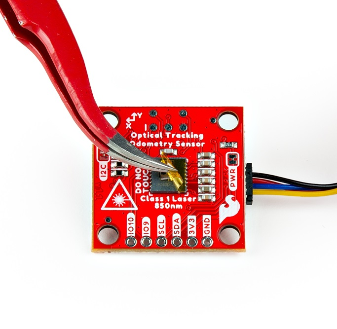

The SparkFun Optical Tracking Odometry Sensor needs to be rigidly mounted to a robot chassis and oriented flat to the floor in order to get accurate data. If you don't already have a mount, there are a few 3D printing models you can use. That said, you may need to design your own mount for this board, depending on your use case. 

The height that the sensor needs to be mounted will be dependent on the surface being read. If you have a shiny or glossy surface, you should be able to mount the sensor anywhere in the range of 10mm to 27mm, measured from the front face of the optical sensor. If you have a darker or more diffuse surface, you may need to mount the sensor at the low-end of that range. You'll need to test to determine what height works for your surface.

You can access the XRP mount on Printables:  

	[XRP Mount on Printables](https://www.printables.com/model/872179-odometry-clip-for-xrp){ .md-button .md-button--primary target="_blank" }

!!! warning

	Accurate readings require that the sensor is mounted correctly; attempting to move the sensor by hand may work, but tracking accuracy will suffer.

The image below shows the 3D mounted clip with the Optical Tracking Sensor attached to an XRP: 

<figure markdown>
[{ width="600" }](assets/img/SEN-24904-Action-9-Highlighted.jpg "Click to enlarge")
<figcaption markdown>Optical Tracking Sensor Mounted to the XRP</figcaption>
</figure>

Here is the underside of the XRP with the Optical Tracking Sensor attached via the mounting clip: 

<figure markdown>
[{ width="600" }](assets/img/SEN-24904-Action-12-Highlighted.jpg "Click to enlarge")
<figcaption markdown>Optical Tracking Sensor Mounted to the XRP</figcaption>
</figure>

!!! attention

	Reminder - make sure you peel off the yellow kapton tape! 

<figure markdown>
[{ width="600" }](assets/img/SEN-24904-Action-4.jpg "Click to enlarge")
<figcaption markdown>Peel off the Kapton tape before use</figcaption>
</figure>
