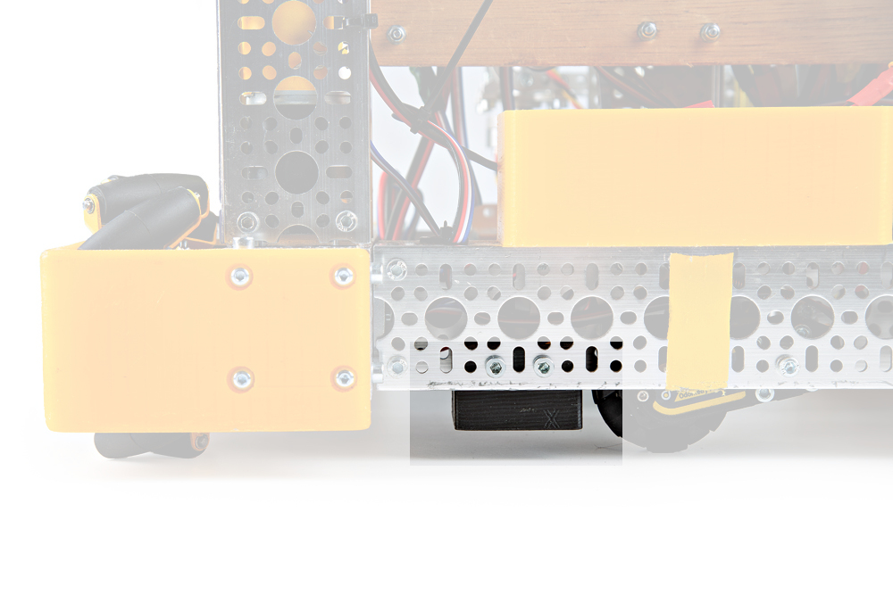
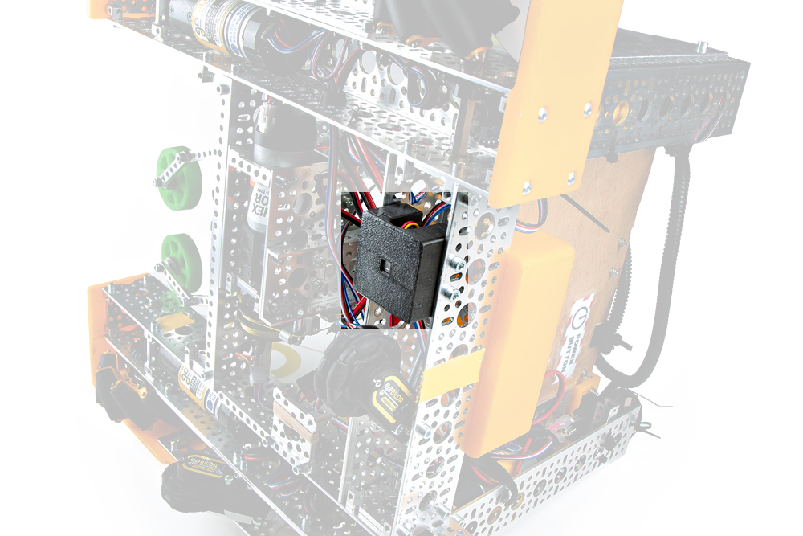
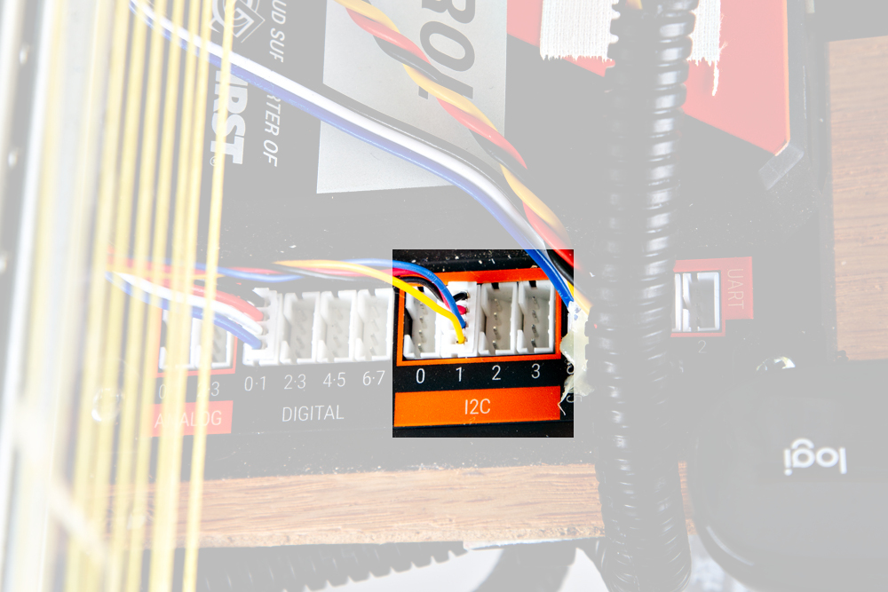
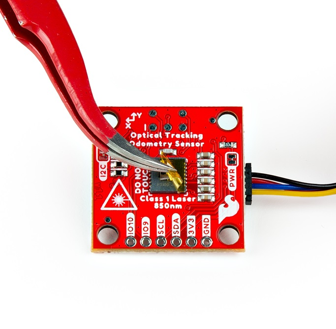

<!--
[{ align="center" width="200"}](assets/img/FIRSTTech_IconVert_RGB.jpg "Click to enlarge")
-->

The SparkFun Optical Tracking Odometry Sensor needs to be rigidly mounted to a robot chassis and oriented flat to the floor in order to get accurate data. If you don't already have a mount, there are a few 3D printing models you can use. That said, you may need to design your own mount for this board, depending on your use case. 

 Note here that we are using the foam surface typical of FIRST Tech Challenge competitions and the sensor is mounted at 10mm from the surface.
 
!!! warning

	Accurate readings require that the sensor is mounted correctly; attempting to move the sensor by hand may work, but tracking accuracy will suffer.
	
	

The FTC mounts are available on Onshape: 

	[FTC mounts on Onshape](https://cad.onshape.com/documents/1253798610182bf3a147f431/w/11cc45e6a7c8080b22bb8377/e/d4827c4f09d804607ba1824b){ .md-button .md-button--primary target="_blank" }

In addition, instructions for the FTC mounts are available here:

	[Instructions for FTC mounts]( https://docs.google.com/document/d/14oHPdummdtDlF2BijsM5kqbD6MTwzaQFkbJ2jo99SUI/edit){ .md-button .md-button--primary target="_blank" }

The image below shows the 3D mounted clip with the Optical Tracking Sensor attached to an FTC Bot: 

<figure markdown>
[{ width="600" }](assets/img/SEN-24904-Action-23-Highlighted.jpg "Click to enlarge")
<figcaption markdown>Optical Tracking Sensor Mounted to the FTC Bot</figcaption>
</figure>

!!! first-tech "FIRST Tech Challenge"

	[{ align="left" width="100"}](assets/img/FIRSTTech_IconVert_RGB.jpg "Click to enlarge")

	FIRST Tech Challenge: Note here that for the foam competition files, the sensor really needs to be mounted at exactly 10mm from the surface with a tolerance of +/ 1mm. Beyond that, the tracking is less accurate; beyond +/- 3mm, and it can't track the foam surface at all.

Here is the underside of the FTC Bot with the Optical Tracking Sensor attached via the mounting clip: 

<figure markdown>
[{ width="600" }](assets/img/SEN-24904-Action-21-Highlighted.jpg "Click to enlarge")
<figcaption markdown>Optical Tracking Sensor Mounted to the FTC Bot</figcaption>
</figure>

Using the [Flexible Qwiic to STEMMA Cable - 500mm](https://www.sparkfun.com/products/25596), you'll need to attach the sensor via one of the I2C connectors on the Control Hub like so:

<figure markdown>
[{ width="600" }](assets/img/SEN-24904-Action-24-Highlighted.jpg "Click to enlarge")
<figcaption markdown>I2C connection location</figcaption>
</figure>

!!! attention

	Reminder - make sure you peel off the yellow kapton tape! 

<figure markdown>
[{ width="600" }](assets/img/SEN-24904-Action-4.jpg "Click to enlarge")
<figcaption markdown>Peel off the Kapton tape before use</figcaption>
</figure>

