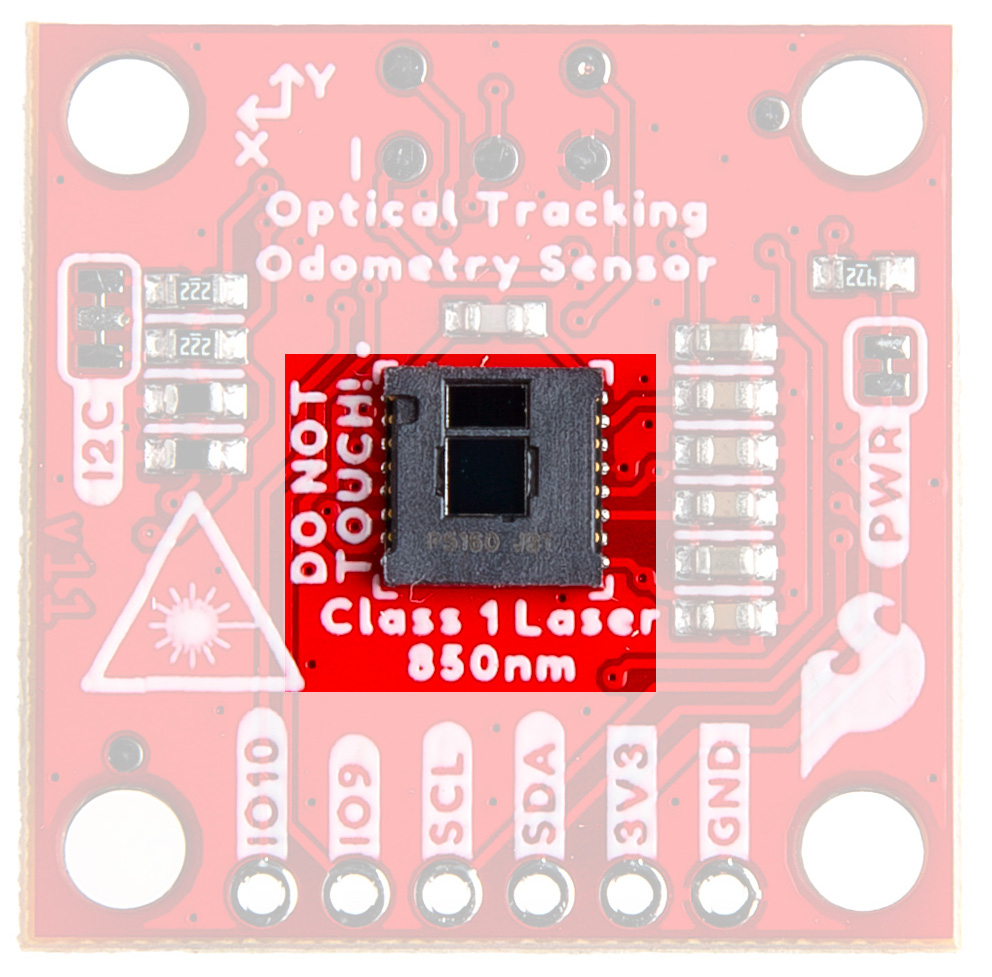
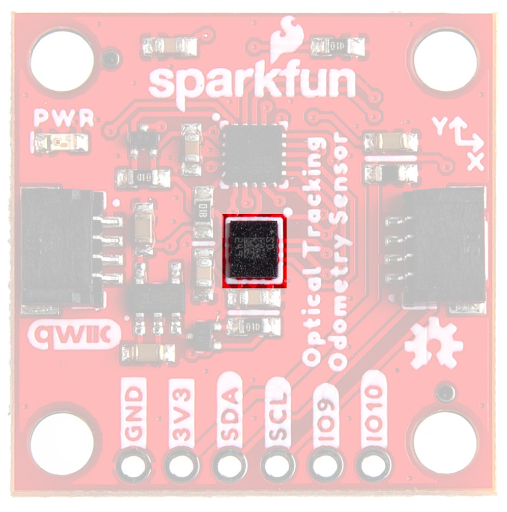
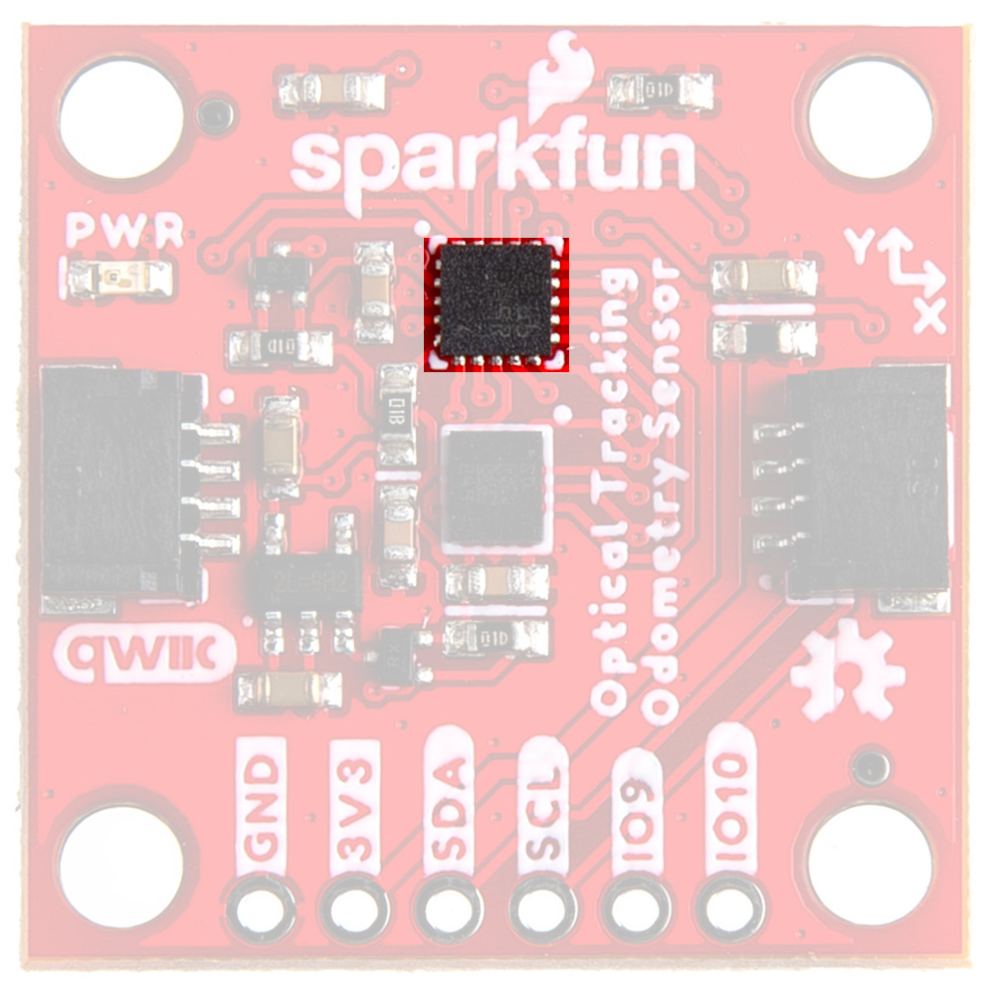
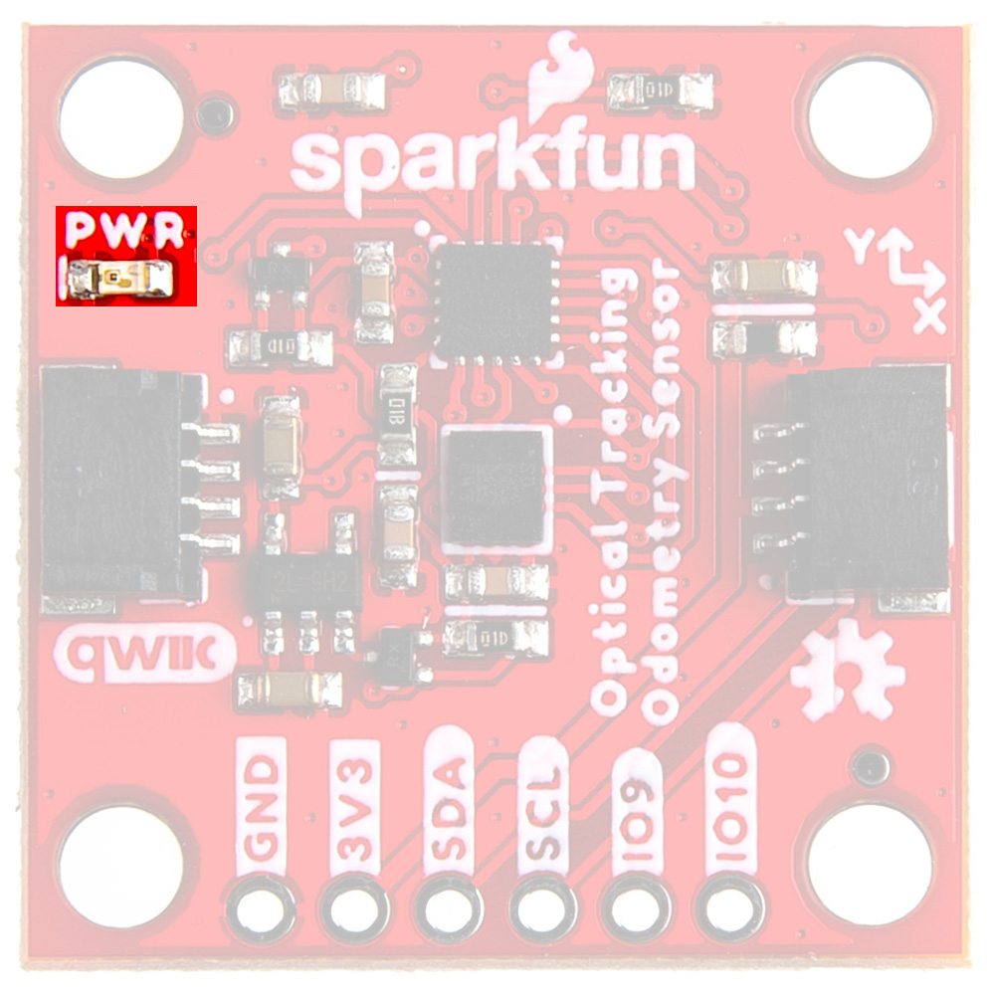
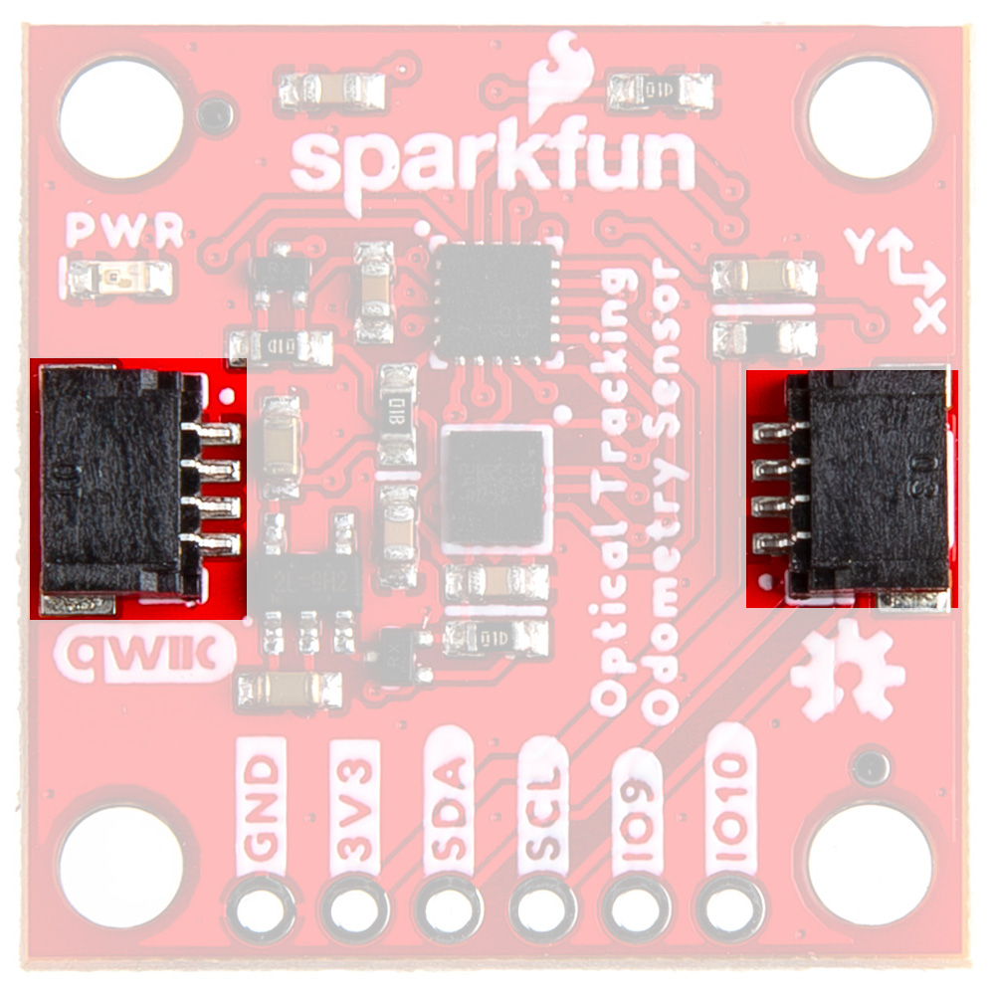
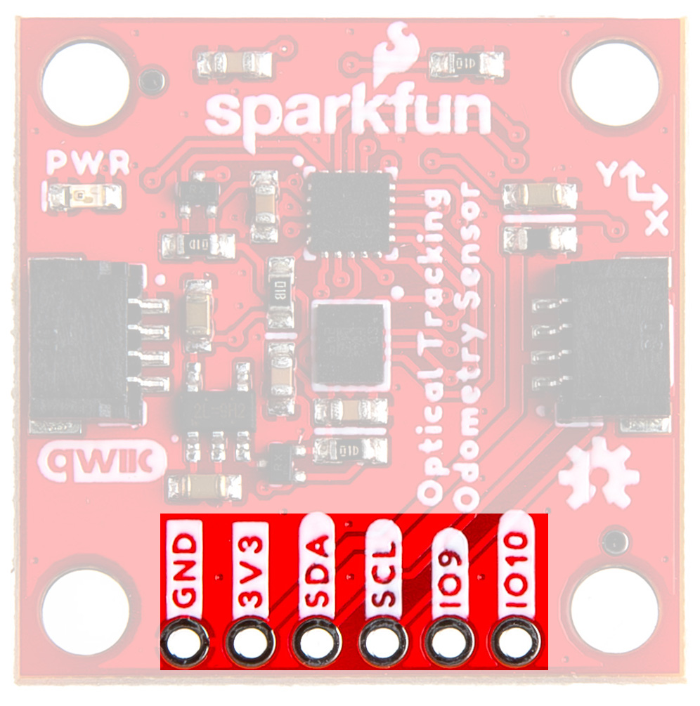
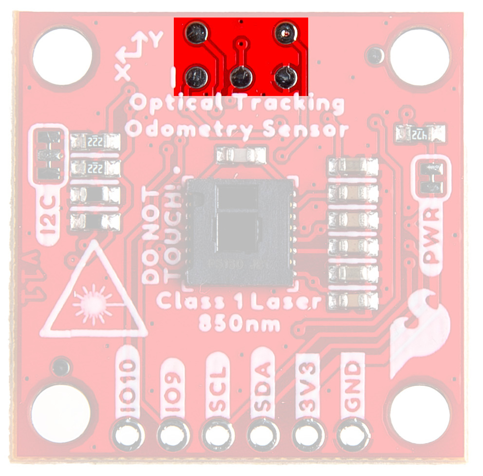
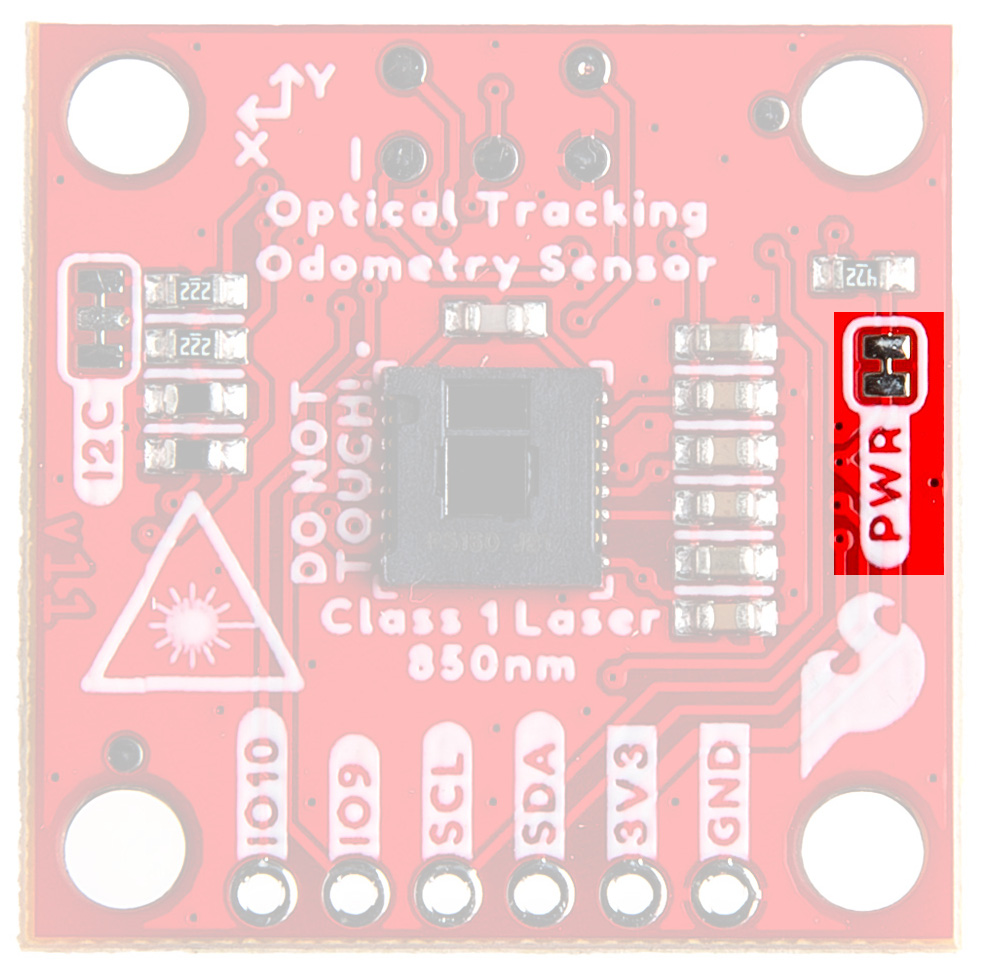
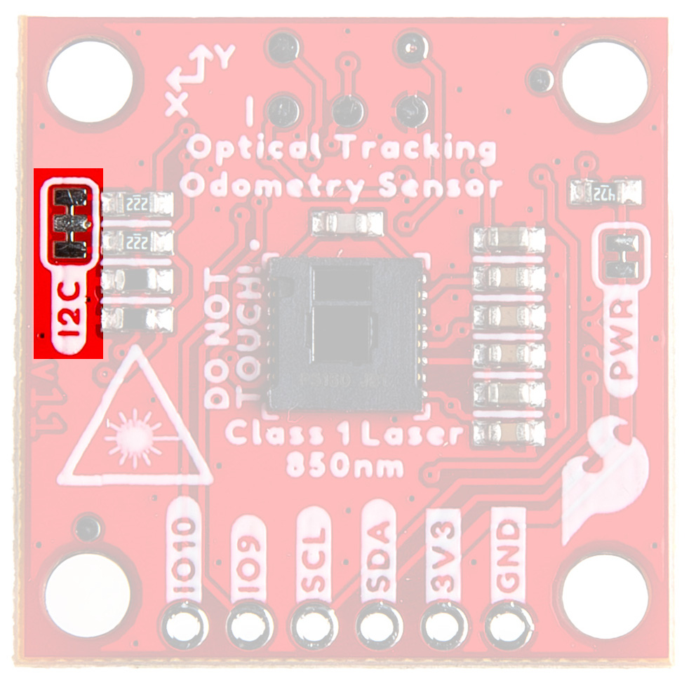
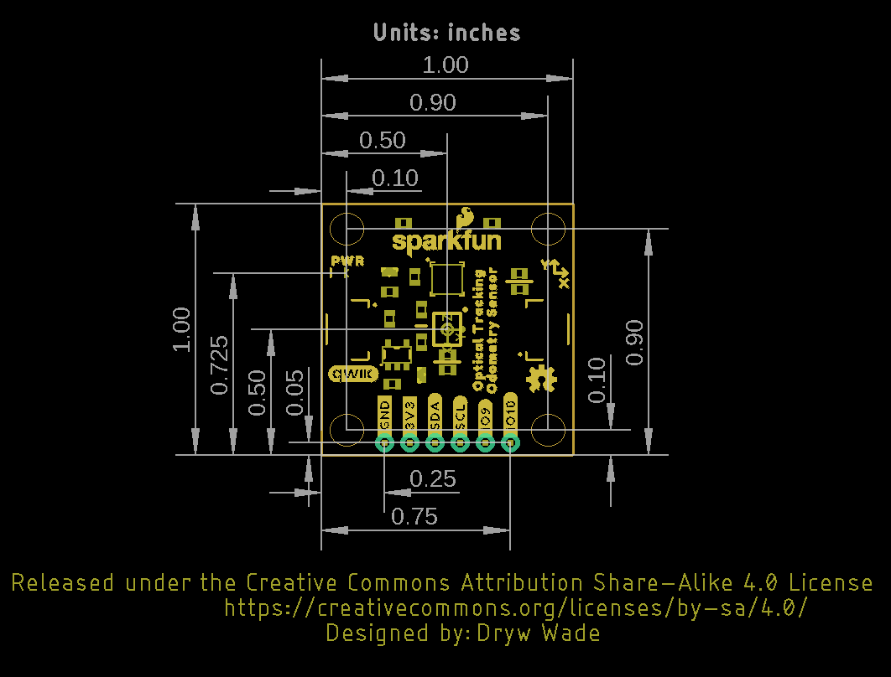

## Optical Tracking Sensor - PAA5160

The PAA5160E1-Q from PixArt Imaging has a tracking speed of 2.5m/s and a typical tracking error rate of 3~5% within a working range of 10mm to 27mm. With an 850nm Class 1 laser, a resolution of 20,000 DPI, and a frame rate of 20,000 fps, it is ideal for surfaces like concrete, epoxy, laminated wood, or glossy/semi-glossy flooring. That said, dark or diffuse surfaces are more challenging, so these specs may vary based on the surfaces that are being used. More information can be found in the [datasheet](assets/documentation/PAA5160_Datasheet_General.pdf){ target="_blank" }.

<figure markdown>
[{ width="400" }](assets/img/24904-Optical-Tracking-Odometry-Sensor_PAA5160E1-Q.jpg "Click to enlarge")
<figcaption markdown>Optical Tracking Sensor - PAA5160</figcaption>
</figure>

!!! warning
	The laser on this module is a Class 1, 850nm laser. Please use appropriate caution. 
	<figure markdown>
	[{ width="400" }](assets/img/laserbeams.gif "Click to enlarge")
	<figcaption markdown>*Lasers...*</figcaption>
	</figure>

## 6-DoF IMU - LSM6DSO

The LSM6DSO from STMicroelectronics has a 3-axis digital accelerometer and 3-axis digital gyroscope featuring a full-scale acceleration range of ±2/±4/±8/±16 g and an angular rate range of ±125/±250/±500/±1000/±2000 dps. For more information, refer to the [datasheet](assets/documentation/lsm6dso.pdf){ target="_blank" }. 

<figure markdown>
[{ width="400" }](assets/img/24904-Optical-Tracking-Odometry-Sensor_LSM6DS0.jpg "Click to enlarge")
<figcaption markdown>LSM6DSO 6-DOF IMU Accelerometer</figcaption>
</figure>

## Microcontroller - STM32C0

The STM32C011F4U6 microcontroller has a high-performance Arm® Cortex®-M0+ 32-bit RISC core operating at up to 48 MHz frequency. It incorporates a memory protection unit (MPU), high-speed embedded memory (6 Kbytes of SRAM and up to 32 Kbytes of flash program memory with read and write protection), DMA, an extensive range of system functions, enhanced I/Os, and peripherals. The device offers standard communication interfaces (one I2C, one SPI / one I2S, and two USARTs), one 12-bit ADC (2.5 MSps) with up to 15 channels, a low-power RTC, an advanced control PWM timer, four general-purpose 16-bit timers, two watchdog timers, and a SysTick timer. For more information, refer to the [datasheet](assets/documentation/stm32c011d6-3082107.pdf){ target="_blank" }.

<figure markdown>
[{ width="400" }](assets/img/24904-Optical-Tracking-Odometry-Sensor_STM32.jpg "Click to enlarge")
<figcaption markdown>STM32 Processor</figcaption>
</figure>

## Power

The LED indicator lights when power is provided to the board. 

<figure markdown>
[{ width="400" }](assets/img/24904-Optical-Tracking-Odometry-Sensor_PowerLED.jpg "Click to enlarge")
<figcaption markdown>Power LED</figcaption>
</figure>

## Qwiic Connectors

The Qwiic Connectors on the SparkFun Optical Tracking Odometry Sensor - PAA5160E1 (Qwiic) provide power and I2C connectivity simultaneously. The I2C address is 0x17.

<figure markdown>
[{ width="400" }](assets/img/24904-Optical-Tracking-Odometry-Sensor_QwiicConnex.jpg "Click to enlarge")
<figcaption markdown>Qwiic Connectors</figcaption>
</figure>

## GPIO

The PTH pins on the side of the board allow you to provide power, access the I2C Data and Clock lines, and there are two pins available for UART/generic programming purposes. In normal operation, IO9 acts as a "data ready" interrupt; this pin could be used to synchronize measurements if needed. Outside of normal operation, IO9 and IO10 provide a UART interface that can be used for firmware updates, see instructions [here](https://github.com/sparkfun/SparkFun_Optical_Tracking_Odometry_Sensor/tree/main/Firmware). 

<figure markdown>
[{ width="400" }](assets/img/24904-Optical-Tracking-Odometry-Sensor_GPIO.jpg "Click to enlarge")
<figcaption markdown>GPIO</figcaption>
</figure>

## Debugging Test Points

We've broken out test points for serial wire debugging if you wish to access flash memory or directly program the board. They are located here: 

<figure markdown>
[{ width="400" }](assets/img/24904-Optical-Tracking-Odometry-Sensor_DbgTestPoints.jpg "Click to enlarge")
<figcaption markdown>Debugging Test Points</figcaption>
</figure>

## Jumpers

??? note "Never modified a jumper before?"
	Check out our <a href="https://learn.sparkfun.com/tutorials/664">Jumper Pads and PCB Traces tutorial</a> for a quick introduction!
	

		<a href="https://learn.sparkfun.com/tutorials/664">
		 
        How to Work with Jumper Pads and PCB Traces</a>
	

### Power Jumper

If you are concerned about power consumption, need to run dark, or just really don't like LEDs, cut the jumper highlighted below to disconnect power from the LED on the front of the board. 

<figure markdown>
[{ width="400" }](assets/img/24904-Optical-Tracking-Odometry-Sensor_LEDJumper.jpg "Click to enlarge")
<figcaption markdown>Power Jumper</figcaption>
</figure>

### I2C Jumper

If you choose to use one or more Qwiic breakouts in your project, it is important to note that this board comes equipped with pull-up resistors on the clock and data pins. If you are daisy-chaining multiple Qwiic devices, you will want to cut this jumper; if multiple sensors are connected to the bus with the pull-up resistors enabled, the parallel equivalent resistance will create too strong of a pull-up for the bus to operate correctly. As a general rule of thumb, disable all but one pair of pull-up resistors if multiple devices are connected to the bus. To disable the pull up resistors, use an X-acto knife to cut the joints between the jumper pads highlighted below.

<figure markdown>
[{ width="400" }](assets/img/24904-Optical-Tracking-Odometry-Sensor_I2CJumper.jpg "Click to enlarge")
<figcaption markdown>I2C Jumper</figcaption>
</figure>

## Board Dimensions

The board dimensions are illustrated in the drawing below; the listed measurements are in inches.

<figure markdown>
[{ width="600" }](assets/board_files/24904_SparkFun_Optical_Tracking_Odometry_Sensor_BoardOutline.png "Click to enlarge")
<figcaption markdown>SparkFun Optical Tracking Odometry Sensor Board Dimensions</figcaption>
</figure>

??? tip "Need more measurements?"
	For more information about the board's dimensions, users can download the [Eagle files](assets/board_files/24904_SparkFun_Optical_Tracking_Odometry_Sensor_EagleFiles.zip). These files can be opened in Eagle and additional measurements can be made with the dimensions tool.

	??? info ":octicons-download-16:{ .heart } Eagle - Free Download!"
		Eagle is a [CAD]("computer-aided design") program for electronics that is free to use for hobbyists and students. However, it does require an account registration to utilize the software.

		

		[Download from :autodesk-primary:{ .autodesk }](https://www.autodesk.com/products/eagle/free-download "Go to downloads page"){ .md-button .md-button--primary width="250px" }
		

	
	??? info ":straight_ruler: Dimensions Tool"
		This video from Autodesk demonstrates how to utilize the dimensions tool in Eagle, to include additional measurements:

		

		

		<iframe src="https://www.youtube.com/embed/dZLNd1FtNB8" title="EAGLE Dimension Tool" frameborder="0" allow="accelerometer; autoplay; clipboard-write; encrypted-media; gyroscope; picture-in-picture" allowfullscreen></iframe>
		

		

