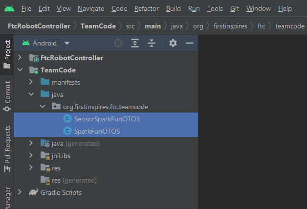

!!! warning

	These instructions are for Android Studio users only! Software support may be built into the SDK at a future date for Onbot Java and Blocks users as well, but only Android Studio is supported at this time.

# Adding the Driver

In order for the Optical Tracking Odometry Sensor to be recognized in the hardware configuration, you must first add the driver and upload it to the robot. It is also recommended to add the sample OpMode at the same time.

To do so, you'll need the driver (`SparkFunOTOS.java`) and sample OpMode (`SensorSparkFunOTOS.java`) from the [SparkFun Optical Tracking Odometry Sensor FTC Java Library GitHub Repo](https://github.com/sparkfun/SparkFun_Qwiic_OTOS_FTC_Java_Library). You can download them from the link or click on the button below: 

	[SparkFun Optical Tracking Odometry Sensor FTC Java Library](https://github.com/sparkfun/SparkFun_Qwiic_OTOS_FTC_Java_Library/archive/refs/heads/main.zip){ .md-button .md-button--primary }

Once you have the driver and sample OpMode files, add them to your TeamCode folder like so:

<figure markdown>
[{ width="600" }](assets/img/android_studio.png "Click to enlarge")
<figcaption markdown>Android Studio</figcaption>
</figure>

Then upload the code to your robot like normal.

# Hardware Configuration

Make sure you've added the driver and uploaded it to the robot as outlined above. You can edit your robot's hardware configuration from the Driver Station. Select the I2C port that the OTOS is connected to, then tap the "Add" button. From the dropdown, you should see "SparkFun OTOS" like so:

<figure markdown>
[{ width="600" }](assets/img/hardware_config.png "Click to enlarge")
<figcaption markdown>Hardware Configuration</figcaption>
</figure>

!!! warning
	If you don't see "SparkFun OTOS" in the dropdown, make sure you have added the driver and uploaded it to your robot. 

Then enter a name for the sensor. The sample OpMode assumes it is named `sensor_otos`, so that is recommended.

Once done, save your hardware configuration, then you're ready to run the sample OpMode!
