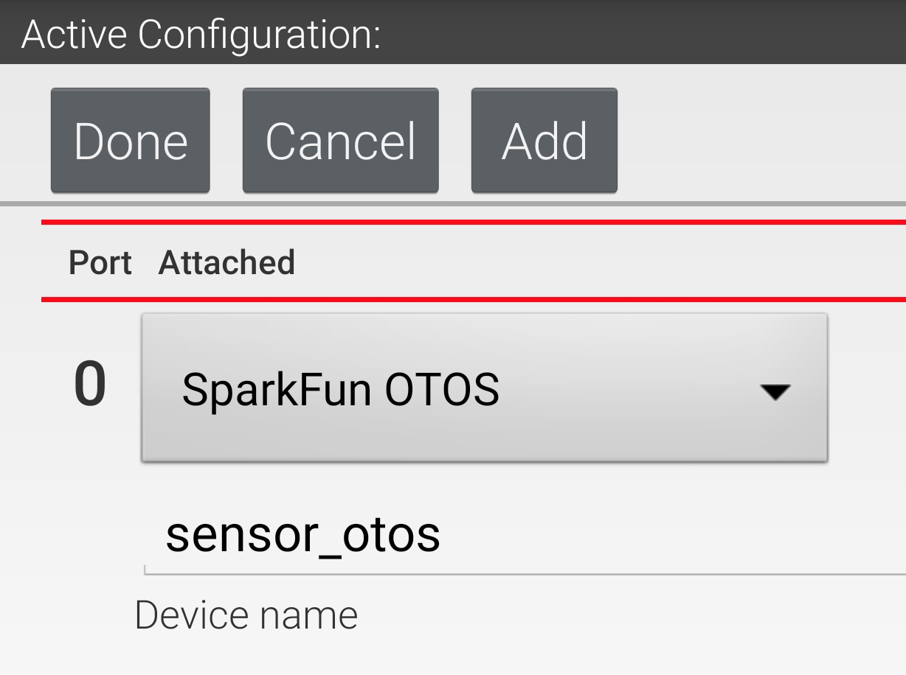

## Update the FTC Robot Controller

!!! attention

	Version v9.2 of the [FTC SDK](https://github.com/sparkfun/SparkFun_Qwiic_OTOS_FTC_Java_Library) added [our Java driver](https://github.com/sparkfun/SparkFun_Qwiic_OTOS_FTC_Java_Library), so it is no longer necessary to manually install those files. Make sure you have at least v9.2 installed on your Control Hub before continuing!

## Hardware Configuration

You can edit your robot's hardware configuration from the Driver Station. Select the I2C port that the OTOS is connected to, then tap the "Add" button. From the dropdown, you should see "SparkFun OTOS" like so:

<figure markdown>
[{ width="600" }](assets/img/hardware_config.png "Click to enlarge")
<figcaption markdown>Hardware Configuration</figcaption>
</figure>

!!! warning

	If you don't see "SparkFun OTOS" in the dropdown, make sure you have updated your Control Hub to use at least version v9.2 of the FTC SDK. 

Then enter a name for the sensor. The sample OpMode assumes it is named `sensor_otos`, so that is recommended.

Once done, save your hardware configuration, then you're ready to run the sample OpMode!
