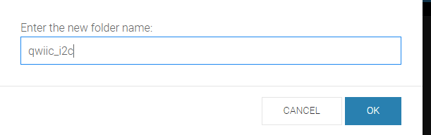
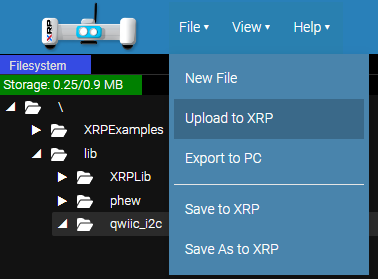
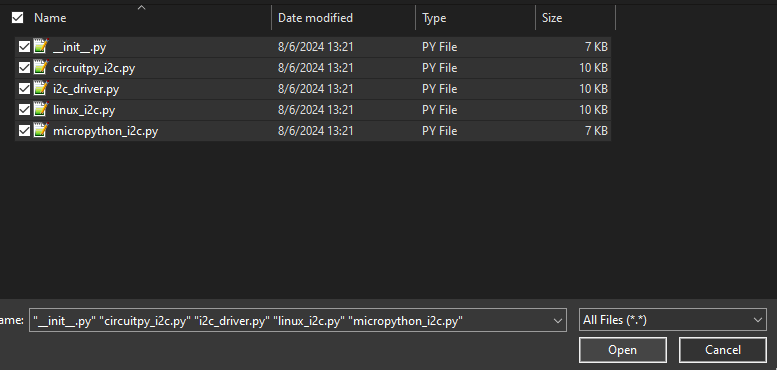
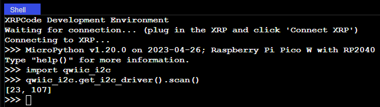
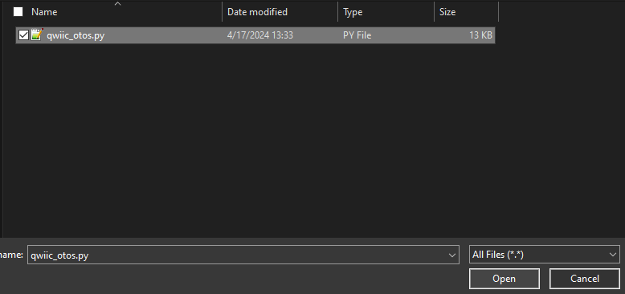
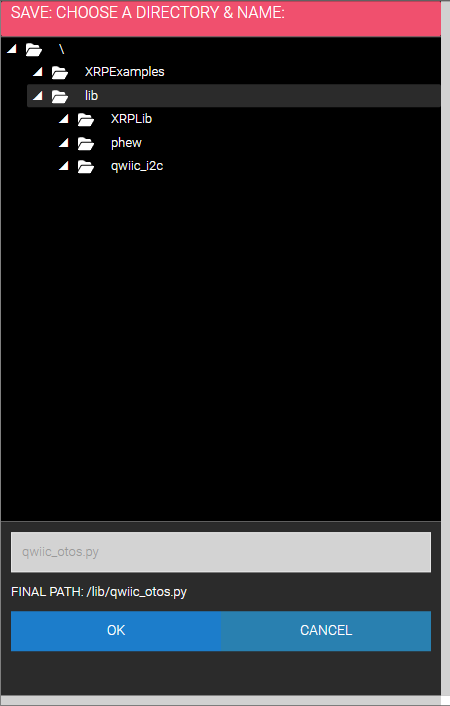
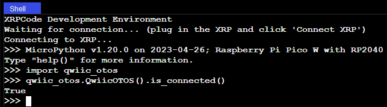

!!! attention
	If this is your first time working with Python, there are quite a few useful tutorials on getting started. The [Python Programming Section](https://learn.sparkfun.com/tutorials/python-programming-tutorial-getting-started-with-the-raspberry-pi/programming-in-python) of our Getting Started with the Raspberry Pi Tutorial has some good basic information and resources for getting started with Python. 


## Linux/Raspberry Pi Variants

We've written a python package to get you started with the SparkFun Optical Tracking Odometry Sensor. It's been included in the SparkFun Qwiic Python package, which aggregates all Python Qwiic drivers/modules to provide a single entity for Qwiic within a Python environment. The [Qwiic_Py GitHub Library ReadMe](https://github.com/sparkfun/Qwiic_Py) has more information on the Qwiic Python package. 

If you already have your Qwiic Python package installed, you can update it with the following command: 

```
pip install --upgrade sparkfun-qwiic

```

If you don't have the Qwiic Python package installed already, you can install it with the following command: 

```
pip install sparkfun-qwiic

```


If you prefer to install just this package, use the following command: 

```
pip install sparkfun-qwiic-otos

```

If you prefer downloading the code to build and install the package manually, you can grab them from the [GitHub Repository](https://github.com/sparkfun/Qwiic_Py).

<center>
	[SparkFun Optical Tracking Odometry Sensor Python Package GitHub](https://github.com/sparkfun/Qwiic_OTOS_Py/archive/refs/heads/master.zip){ .md-button .md-button--primary }
</center>


!!! attention
	If you are working with a Raspberry Pi and are using the new Bookworm distribution of the Raspberry Pi OS, refer to [these instructions](https://www.raspberrypi.com/documentation/computers/os.html#python-on-raspberry-pi) to setup a virtual environment.  

	Make sure to include the --system-site-packages flag:python3 -m venv <name of virtual environment> --system-site-packages 
	
	Then it is possible to install the packages using pip. 


## XRP/MicroControllers

If you are working with the XRP or other microcontroller, pip will not work for you. Instead, you'll need to install the Qwiic_I2C_Py driver as well as the Qwiic_OTOS driver. 

!!! attention
	These instructions are written for the XRP using the [XRPCode IDE](https://xrpcode.wpi.edu/). However the setup process is very similar for MicroPython and CircuitPython on any other board, so you should be able to follow along with these instructions using your IDE of choice!

### Install Qwiic_I2C_Py

Qwiic_I2C_Py is a generic I2C driver we have created to work on various platforms (such as MicroPython). Our Qwiic Python device drivers take advantage of Qwiic_I2C_Py to function correctly on any of the supported platforms, so it is a required dependency to use our OTOS Python driver.

Fist, go to the [Qwiic_I2C_Py repository](https://github.com/sparkfun/Qwiic_I2C_Py) and download it as a .zip file. Once downloaded, extract the `qwiic_i2c` folder within.

Connect your XRP to your computer over USB, navigate to the [XRPCode IDE](https://xrpcode.wpi.edu/), and connect to your XRP. For usage information, see the [XRPCode User Guide](https://xrpusersguide.readthedocs.io/en/latest/course/XRPCode.html).

Create a new folder within the `lib` directory (right-click on the folder), and name it `qwiic_i2c`.

<figure markdown>
[{ width="400" }](assets/img/xrp_software_setup/new_folder.png "Click to enlarge")
<figcaption markdown>Create a new folder in the `lib` directory</figcaption>
</figure>


<figure markdown>
[{ width="400" }](assets/img/xrp_software_setup/new_folder_name.png "Click to enlarge")
<figcaption markdown>Name the folder `qwiic_i2c`</figcaption>
</figure>

Upload the files from the previously extracted `qwiic_i2c` folder into the new folder you just created on the XRP. From the **File** menu, choose the Upload to XRP option: 

<figure markdown>
[{ width="400" }](assets/img/xrp_software_setup/upload.png "Click to enlarge")
<figcaption markdown>Choose the "Upload to XRP" option</figcaption>
</figure>

Then select the extracted files: 

<figure markdown>
[{ width="400" }](assets/img/xrp_software_setup/select_qwiic_i2c_files.png "Click to enlarge")
<figcaption markdown>Select the extracted I2C Files</figcaption>
</figure>

Then choose the newly created `qwiic_i2c` folder on the XRP:

<figure markdown>
[{ width="400" }](assets/img/xrp_software_setup/select_qwiic_i2c_upload_directory.png "Click to enlarge")
<figcaption markdown>Choose the newly created `qwiic_i2c` folder</figcaption>
</figure>

Uploading...

<figure markdown>
[{ width="400" }](assets/img/xrp_software_setup/update_in_progress.png "Click to enlarge")
<figcaption markdown>Update in Progress</figcaption>
</figure>


You can test to confirm correct installation by typing `import qwiic_i2c` followed by `qwiic_i2c.get_i2c_driver().scan()` in the Shell. If no errors are printed, then the Qwiic_I2C_Py driver has been installed correctly!

<figure markdown>
[{ width="400" }](assets/img/xrp_software_setup/qwiic_i2c_test.png "Click to enlarge")
<figcaption markdown>Testing the install</figcaption>
</figure>

### Install Qwiic_OTOS_Py

Fist, go to the [Qwiic_OTOS_Py repository](https://github.com/sparkfun/Qwiic_OTOS_Py) and download just the `qwiic_otos.py` file.

Connect your XRP to your computer over USB, navigate to the [XRPCode editor](https://xrpcode.wpi.edu/), and connect to your XRP. For usage information, see the [XRPCode User Guide](https://xrpusersguide.readthedocs.io/en/latest/course/XRPCode.html).

Upload the `qwiic_otos.py` file into the `lib` folder on the XRP. From the **File** menu, choose the Upload to XRP option: 

<figure markdown>
[{ width="400" }](assets/img/xrp_software_setup/upload.png "Click to enlarge")
<figcaption markdown>Select the "Upload to XRP" Option from the File Menu</figcaption>
</figure>

Select the qwiic_otos.py file: 

<figure markdown>
[{ width="400" }](assets/img/xrp_software_setup/select_otos_file.png "Click to enlarge")
<figcaption markdown>Select the qwiic_otos.py file</figcaption>
</figure>

Then select the lib folder on the XRP:

<figure markdown>
[{ width="400" }](assets/img/xrp_software_setup/select_qwiic_otos_upload_directory.png "Click to enlarge")
<figcaption markdown>Select the lib folder on the XRP</figcaption>
</figure>

Updating... 

<figure markdown>
[{ width="400" }](assets/img/xrp_software_setup/update_in_progress.png "Click to enlarge")
<figcaption markdown>Updating</figcaption>
</figure>

You can test to confirm correct installation by typing `import qwiic_otos` followed by `qwiic_otos.QwiicOTOS().is_connected()` in the Shell. If no errors are printed, then the Qwiic_OTOS_Py driver has been installed correctly!

Testing the install:

<figure markdown>
[{ width="400" }](assets/img/xrp_software_setup/qwiic_otos_test.png "Click to enlarge")
<figcaption markdown>Testing the install</figcaption>
</figure>


## Visualization

In addition to the package provided here, we have written a Python script that allows you to visualize the XRP in real time. Download via the button below. 

<center>
	[XRP Visualization Script](assets/SparkFun_OTOS_XRP_Visualization.zip){ .md-button .md-button--primary download="SparkFun_OTOS_XRP_Visualization.zip" }
</center>


<figure markdown>
[{ width="600" }](assets/img/SEN-24904-Action-GIF-1.gif "Click to enlarge")
<figcaption markdown>Visualization Script in Action</figcaption>
</figure>


